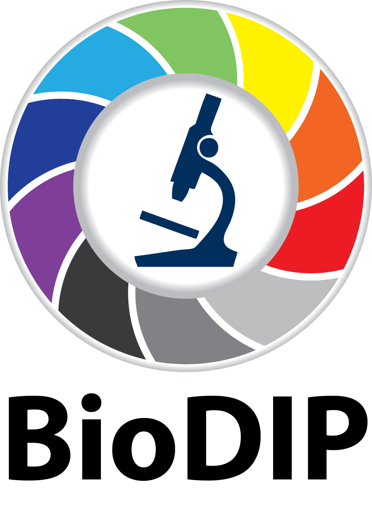
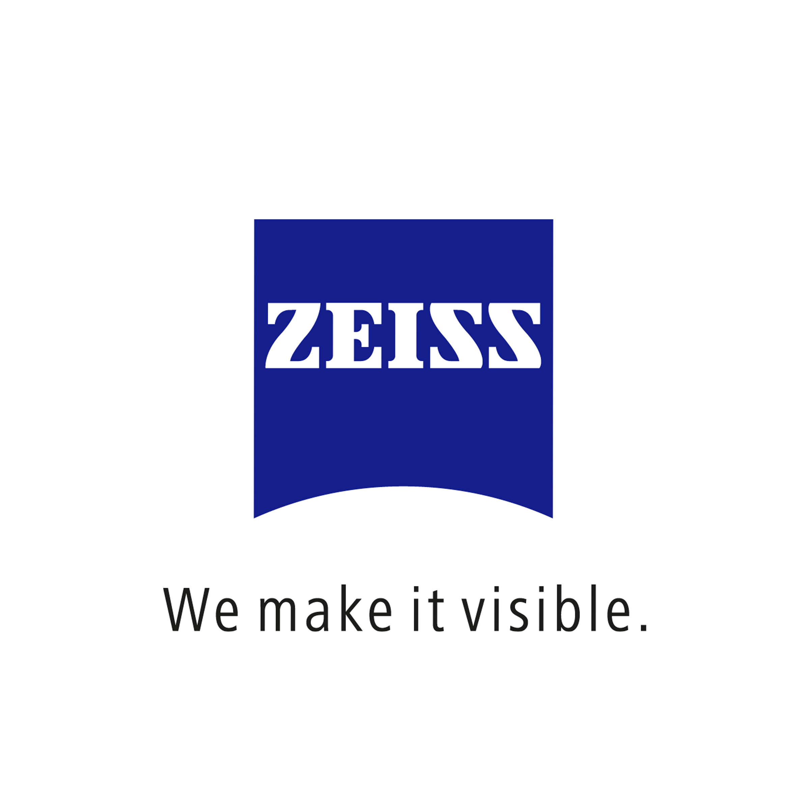
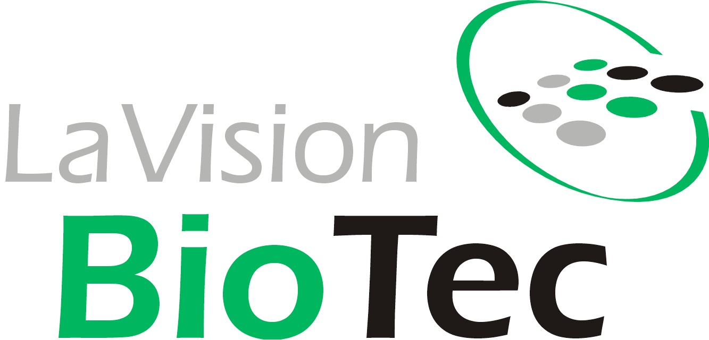
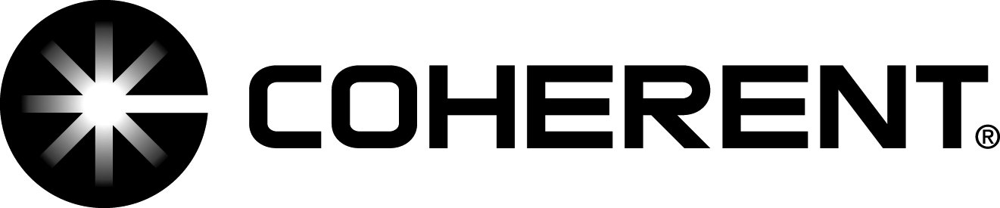

{% include image src="EMBO_PracticalCourse_stamp_web_DARK.jpg" width="70%" caption="" %}

Light-sheet microscopy is an emerging technology that enables imaging of biological specimens with minimal photo-damage. It opens new avenues to study cell biological and developmental processes with unprecedented imaging speed. It also facilitates systems biology approaches by quantitative imaging of entire living systems. Light-sheet microscopy has only recently left the optical tables of technology developers and became more broadly available through commercial and open-access platforms. This EMBO Practical Course will comprehensively introduce the light sheet microscopy paradigm to the new generation of scientists.

18 – 29 August 2014 | <b>Dresden, Germany</b>

<table>
<tr class="odd">
<td>
<a href="EMBO_2014_final_program"><strong>Final Program</strong></a>
</td>
<td>
<a href="EMBO_2014_Organizers"><strong>Organizers</strong></a>
</td>
<td>
<a href="EMBO_2014_Speakers"><strong>Speakers</strong></a>
</td>
<td>
<a href="Team_Lucifer"><strong>Team Lucifer</strong></a>
</td>
</tr>
<tr class="even">
<td>
<a href="EMBO_instrument_schedule"><strong>Instrument schedule</strong></a>
</td>
<td>
<a href="Team_Clarity"><strong>Team Clarity</strong></a>
</td>
<td></td>
<td></td>
</tr>
<tr class="odd">
<td>
<a href="https://mapsengine.google.com/map/viewer?mid=zwloKEna7htk.kHdkHKvGftgY"><strong>Maps</strong></a> 
<a href="EMBO_2014_pictures"><strong>Pictures</strong></a>
</td>
<td>
<a href="EMBO_2014_Participants"><strong>Participants</strong></a>
</td>
<td>
<a href="EMBO_2014_Instructors"><strong>Instructors</strong></a>
</td>
<td>
<a href="Team_SPIMApes"><strong>Team SPIMApes</strong></a>
</td>
</tr>
<tr class="even">
<td><a href="EMBO_2014_linux_refcard">Linux Reference Card</a> 
<a href="https://upload.wikimedia.org/wikipedia/commons/8/89/Cheatsheet-mediawiki.pdf">Wiki Editing cheat sheet</a></td>
<td><a href="Team_SiedyZsig"><strong>Team SiedyZsig</strong></a></td>
<td></td>
<td></td>
</tr>
</table>

<table>
<tr>
<td></td>
<td></td>
<td></td>
<td></td>
<td></td>
<td></td>
<td></td>
<td></td>
<td></td>
<td></td>
</tr>
</table>
