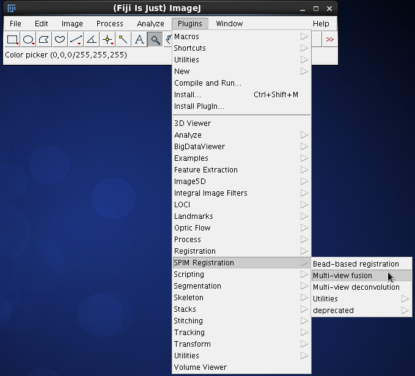
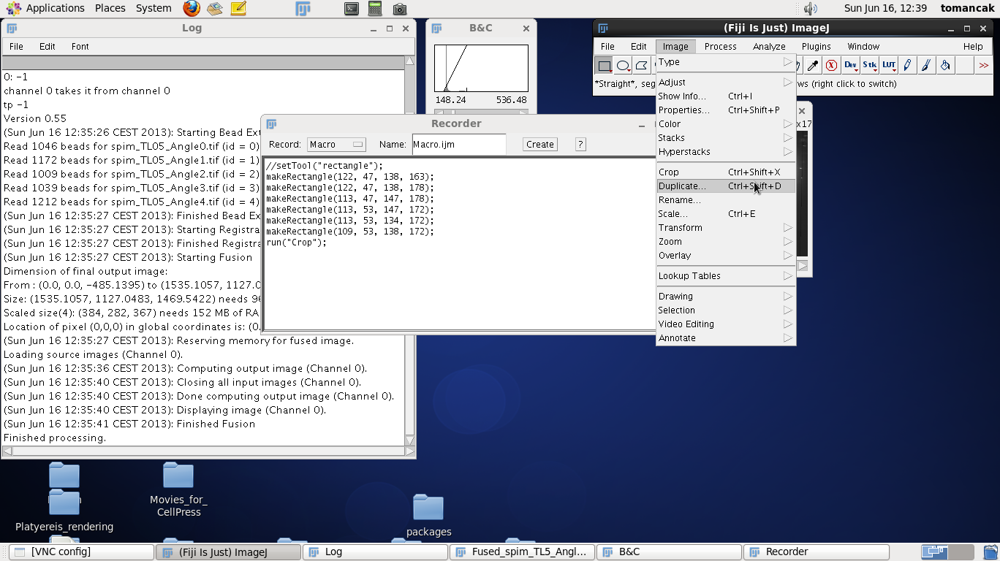
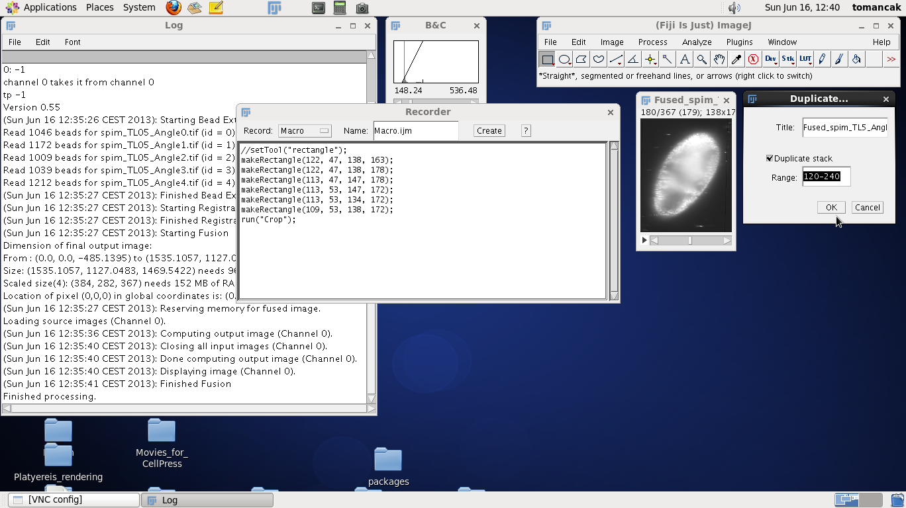

# Fusion

[**Registered**](Registration "wikilink") multi-view OpenSPIM data need
to be fused into a single output image in order to achieve complete
coverage of a large specimen. Fusion means here combining information
from different views in areas where the views overlap. Several
strategies to do so exist, many are published (ADD REFS LATER). We will
focus here on the two fusion methods implemented in Fiji - the content
based multiview fusion and multiview deconvolution.

''Note that fused data are different, not necessarily better compared to
raw SPIM data. Both fusion algorithms described here potentially
deteriorate the quality of the data in some respects while improving
other aspects. We will discuss the fusion artefacts in the respective
sections. However it should be said that sometimes it is beneficial to
NOT fuse the data at all and perform analysis on the raw registered
image stacks (for example segmentation of cells in the individual views
and reconciliation of the results in the segmentation domain). In the
section on of this tutorial on [**browsing**](Browsing "wikilink") we
will describe how to view raw registered multi-view OpenSPIM views.

# Content Based Fusion

The content based multi-view fusion evaluates local information entropy
in the areas where several views overlap and combines the views by
enhancing the low entropy information from the view containing useful
data while suppressing the high entropy noise from the blurred data in
other views. The principles of the method are discussed in depth
[**here**](http://fiji.sc/SPIM_Registration_Method#Image_Fusion_and_blending)
and the parameters of the Fiji plugin implementing the method are
described [**here**](http://fiji.sc/Multi-View_Fusion). As before we
enhance these technical description with tutorial style walk through
using the [sample OpenSPIM data](Raw_data "wikilink").

Content based multi-view fusion requires significant [computational
resources](Pre-requisites "wikilink"). The input raw data stacks are
large and when they are transformed to the position where they overlap,
the bounding box of the output volume can become several fold larger. To
process on such large volumes can take significant amount of time and it
may fail due to insufficient memory even on the largest computer systems
(we did experience out of memory exceptions on a system with 128GB of
RAM\!). Therefore we will proceed sequentially, minimising the memory
footprint.

  - first we will fuse **four times down-sampled** data with all
    computationally demanding options turned off - see [**First
    approximate run**](Fusion#First_approximate_run "wikilink").
  - next we will **crop** the output volume to include only the specimen
    - see [**Cropping**](Fusion#Cropping "wikilink").
  - finally we will fuse the **cropped** volume with all options turned
    on - see [**Final run**](Fusion#Final_run "wikilink").

## First approximate run

The purpose of this run is to get to the output fused data as quickly as
possible in order to evaluate them and decide on how to continue.

### Input

<table>
<tbody>
<tr class="odd">
<td>
 We start the Content based fusion plugin from <strong>Plugins-&gt;SPIM Registration-&gt;Multi-view fusion</strong> (or pressing letter <strong>l</strong> and typing Multi etc.).
</td>
</tr>
<tr class="even">
<td>

 In the first dialog we will accept the default <strong>Single channel</strong> channel type option and click <strong>Ok</strong>.
</td>
</tr>
<tr class="odd">
<td>

 The second dialog should look familiar. In fact if you have run the <a href="Registration" title="wikilink"><strong>registration</strong></a> of timepoint <strong>5</strong> before it should be pre-filled with all the necessary data (SPIM data directory, Pattern of SPIM file, Time-points to process and Angles to process). See <a href="Registration" title="wikilink">registrarion</a> tutorial for details on the fields. To proceed with fusion of time-point 5 click <strong>Ok</strong>.
</td>
</tr>
<tr class="even">
<td>

 The main dialog of Content based fusion plugin starts with a pull-down <strong>Registration of channel 0</strong>. This pull down should have only a single option available <strong>Individual registration to channel 0</strong>. Later on, after we perform <a href="Timelapse_Registration" title="wikilink">timelapse registration</a> there will be other possibilities. For now it is sufficient to know that this field refers to the <em>.registration</em> files in the <em>/registration</em> directory that contains the <a href="Registration#Output" title="wikilink">registration results</a> (affine transformation matrices). The files need to exist in that directory otherwise the fusion will fail.

Second field <strong>Fusion Method</strong> can be left as default, we want to fuse the data into a single image.

On our 128GB computer we can <strong>Process All views in parallel</strong> we have enough memory. However if you are using a lesser computer and getting the so-called <em>Java heap space</em> exception after launching fusion, you need to choose to process <strong>2</strong> or maybe only <strong>one view</strong> in parallel. <em>Note that this is unlilkely to be a problem if you follow this tutorial since we will downsample the image four times, making it rather small - see below</em>.

<strong>Blending</strong>, <strong>Content based weights</strong> and <strong>Content based weights (fast approximate)</strong> are options that take time and so we leave the checkboxes <strong>unclicked</strong> for this initial quick run. We will return to them later when discussing the <a href="Fusion#Final_run" title="wikilink"><strong>final run</strong></a>.

Importantly, to speed up the processing we enter <strong>4</strong> into the <strong>Downsample output image n-times</strong>.

We will leave the <strong>cropping</strong> fields at 0 (we return them in the chapter <a href="Fusion#Cropping" title="wikilink"><strong>cropping</strong></a>).

Finally, the last pull down menu <strong>Fused image output</strong> allows us to choose to either

<ul>
<li><em>Display only</em> - simply display the output without saving</li>
<li><em>Save 2d-slices, all in one directory</em> - save the output volume into a single directory one image per slice. ''Note that when processing long-term time-lapse this can amount to literally hundreds of thousands of images, it has benefits in terms of loading the data into Fiji as virtual stack, but your file system may not like it, thus...</li>
<li><em>Save 2d-slices, one directory per timepoint</em> - is a more sensible option, it will put all slices for one timepoint into a directory named by the timepoint index, i.e. for timepoint 5 it will be directory <strong>output/5</strong></li>
</ul>

We are ready to launch the fusion by clicking <strong>OK</strong>.
</td>
</tr>
</tbody>
</table>

### Run

 As before, let us annotate the output
the fusion plugin sends to the **Log** window.

`dir: /home/tomancak/Desktop/OpenSPIM_for_website/tiffs/registration`  
`spim_TL05_Angle0.tif.registration`  
`Z-stretching = ``9.30232558139535`

The plugin identifies the registration files and reads in the z-scaling.

`0: -1`  
`channel 0 takes it from channel 0`  
`tp -1`  
`Version 0.55`  
`(Thu Jun 06 00:11:09 CEST 2013): Starting Bead Extraction`  
`Read 1046 beads for spim_TL05_Angle0.tif (id = 0)`  
`Read 1172 beads for spim_TL05_Angle1.tif (id = 1) `  
`Read 1009 beads for spim_TL05_Angle2.tif (id = 2) `  
`Read 1039 beads for spim_TL05_Angle3.tif (id = 3)`  
`Read 1212 beads for spim_TL05_Angle4.tif (id = 4)`  
`(Thu Jun 06 00:11:09 CEST 2013): Finished Bead Extraction`  
`(Thu Jun 06 00:11:09 CEST 2013): Starting Registration`  
`(Thu Jun 06 00:11:09 CEST 2013): Finished Registration`

It then repeats the registration steps. We will recall that the actual
registration took very short time, once the beads are segmented reading
them in and repeating the optimization is simpler then programming a
specific function that would load the matrices from the files
(apparently - Stephan?).

`(Thu Jun 06 00:11:09 CEST 2013): Starting Fusion`  
`Dimension of final output image:`  
`From : (0.0, 0.0, -485.1395) to (1535.1057, 1127.0483, 984.4027)`  
`Size: (1535.1057, 1127.0483, 1469.5422) needs ``9699 MB`` of RAM`  
`Scaled size(4): (384, 282, 367) needs ``152 MB`` of RAM`

Here we see the benefits of downsampling, the full resolution output
image would need almost 10GB of RAM and thats only the final output
excluding all intermediate steps - the actual memory footprint is
several fold higher. One can easily run out of memory with this data.
However scaled we are down to much more reasonable 152MB for the output
image.

`Location of pixel (0,0,0) in global coordinates is: (0.0, 0.0, -485.1395)`  
`(Thu Jun 06 00:11:09 CEST 2013): Reserving memory for fused image.`  
`Loading source images (Channel 0).`  
`(Thu Jun 06 00:11:17 CEST 2013): Computing output image (Channel 0).`  
`(Thu Jun 06 00:11:19 CEST 2013): Closing all input images (Channel 0).`  
`(Thu Jun 06 00:11:19 CEST 2013): Done computing output image (Channel 0).`  
`(Thu Jun 06 00:11:19 CEST 2013): Displaying image (Channel 0).`  
`(Thu Jun 06 00:11:20 CEST 2013): Finished Fusion`  
`Finished processing.`

Now here is the action, the plugin loads the images, fuses them without
doing any entropy evaluation, closes the input images and displays the
output. Since we are working with 4 times down-sampled data it all takes
only seconds.

A new window will pop-up. This is the **Output** that we will discuss in
the next section.

### Output and Evaluation

<table>
<tbody>
<tr class="odd">
<td>
 At end of the <strong>Run</strong> a new window pops up. Now we finally see our registered OpenSPIM data albeit heavily downsampled.

This is not exactly what we hoped for, there are lines and grey boxes everywhere and the resolution is poor. This is because we downsampled and turned off all fusion bells and whistles. When we scroll through the stack we nonetheless can see that the 5 views making up this timepoint have indeed been registered as there are no obvious discontinuities in the data and the entire embryo is covered.

We are looking at the data from the point of view of the reference view (in this case Angle0). This view hasn't been transformed, we are looking at the data as they were acquired, downsampled and degraded by averaging in the blurred data from other views (we did no content based weightening).
</td>
</tr>
<tr class="even">
<td>
We will use this initial output to demonstrate the fundamental principle of the bead based multi-view registration. Lets turn this stack to look at it along the rotation axis. We do that by running <strong>Plugins-&gt;Transform-&gt;TransformJ-&gt;TransfromJ Turn</strong> and turning the fusion output stack around the <strong>x</strong> axis by <strong>90 degrees</strong>.
</td>
</tr>
<tr class="odd">
<td>
When we now navigate through the turned stack we are looking approximately alongside the rotation axis. We see how the five individual view stacks overlap in the output volume and how the bounding box of that volume becomes consequently large.

We see also the elongated <strong>Point Spread Function</strong> (<strong>PSF</strong>s) of the beads. These axially elongated PSFs cross forming beautiful stars. Their presence around the specimen indicates that the registration was successful.
</td>
</tr>
</tbody>
</table>

## Cropping

In the next step of the fusion pipeline we will crop the output image as
much as possible. Why? You may have noticed that the bounding box of the
fused image is actually rather large (4 x 384x282x367). This is because
we have rotated the input image stacks in 3d and the resulting cubic
volume has to include them all. Saving output images in this form would
increase the storage requirements by orders of magnitude. To reduce the
storage footprint we will use this initial run of fusion to define a
volume that fits the specimen most efficiently. It will also reduce
memory requirements allowing us to run the fusion with full resolution
images.

''Note that in reality it makes sense to define the crop volume only
after the [time-lapse registration](Timelapse_Registration "wikilink"),
because that will be the final output of the pipeline and the crop area
has to be defined relative to that registration. However to preserve
linearity we will describe cropping here.

<table>
<tbody>
<tr class="odd">
<td>
Before you start cropping start a macro recorder. <strong>Macro recorder</strong> will open a window that will report the parameters of commands we run in Fiji. We will need it to note the coordinates of the bounding box.
</td>
<td><figure>
<figcaption>Screenshot of macro recorder, showing where to find it in Fiji menus and the recorder window which has just recorded the running of the macro recorder command (little recursion)</figcaption>
</figure></td>
</tr>
<tr class="even">
<td>
To define the crop area we click on the <strong>rectangle tool</strong> in the main Fiji window and make a rectangle around the contrast adjusted fused data. Move up and down through the z stack to make sure that the rectangle includes all the data. Modify the size of the rectangle by dragging the tiny boxes on the rectangle. Make the rectangle tight around the data but leave a few pixels buffer zone. Note that everytime you adjust the rectangle a new command get recorded in the <strong>Recorder</strong> window, such as <strong>makeRectangle(109, 53, 138, 172);</strong>. The numbers have the following meaning:

<ul>
<li>109 - x coordinate (offset from upper left corner along the x axis)</li>
<li>53 - y coordinate (offset from upper left corner along the y axis)</li>
<li>138 - width of the rectangle</li>
<li>172 - height of the rectangle</li>
</ul>

''Note that we will need those numbers - so either write them down or keep the Recorder window open, which is the point of running it in the first place.

Now we run the <strong>Crop</strong> function from the Fiji menus which will crop the image to the size of the placed rectangle.
</td>
<td>
 
</td>
</tr>
<tr class="odd">
<td>
The cropped image is still too big in the z-direction. Once again move the z-slider up and down to determine at which z-index the data start and end. Remember the two z-indices (for this data roughly 120 and 240). Now to also record them we will run the command <strong>Duplicate</strong> stack from Fiji menus and fill in the numbers as shown on the screenshots to the right. Running the command will duplicate the stack and make it as small as possible without discarding any data. The range will also be recorded in the recorder as highlighted:

<ul>
<li>120 - offset from the bottom of the stack to the bottom of the specimen (the part away from you)</li>
<li>240 - offset from the bottom of the stack to the top of the specimen (the part closer to you)</li>
</ul>

We are done with cropping, we can now proceed to run the fusion one more time with all the bells and whistles turned on taking advantage of the crop parameters to reduce the memory requirements.
</td>
<td>
 
</td>
</tr>
</tbody>
</table>

## Final run

Now that we figured out the minimal crop area we will fuse the data at
full resolution.

<table>
<tbody>
<tr class="odd">
<td>
Start once again the <strong>Plugins-&gt;SPIM registration-&gt;Multi-view fusion</strong> plugin and click through the first two windows, the parameters should be pre-filled (unless you restarted Fiji in the meantime).

<em>We are still working only with the time-point number five</em>.
</td>
<td><figure>
<figcaption>Launching content based multi-view fusion</figcaption>
</figure></td>
<td>
 
</td>
</tr>
<tr class="even">
<td>
Next we will specify some new parameters for fusion. We will use the individual registration beacuse that is the only one we have (unless we have run <a href="Timelapse_Registration" title="wikilink"><strong>time series registration</strong></a> before). We want to fuse into a single output image and we will this time process <strong>two views in parallel</strong> (On our super-duper computer we have enough memory to do them all at once, but it is not a realistic situation).

Click the <strong>Blending</strong> checkbox to turn on blending of intensities at the borders between views (otherwise there would be a visible line where one view abruptly ends).

Select <strong>Content based weigths (fast, approximate)</strong> over the full <em>Content based weights</em>, the difference is negligible and this will compute significantly faster.

This time we will <strong>not downsample</strong> at all - 1 or 0 both signify this.

Next we fill specify the cropping parameters. Alas these numbers on the screenshot do not look familiar. This is because we collected numbers in the previous <a href="Fusion#Cropping" title="wikilink"><strong>cropping</strong></a> section on <strong>four times downsampled</strong> data. Therefore we have to multiply these number by a factor of <strong>four</strong> like this:

<ul>
<li>offset x : 109 x 4 = 436</li>
<li>offset y : 53 x 4 = 212</li>
<li>offset z : 120 x 4 = 480</li>
<li>size x : 138 x 4 = 552</li>
<li>size y : 172 x 4 = 688</li>
<li>size z : (240-120) x 4 = 480 (note that for z we substract the bottom z-index 120 from the top z index 240)</li>
</ul>

Finally we decide to <strong>save the data one directory per time-point</strong> and click <strong>OK</strong> to start processing.
</td>
<td><figure>
<figcaption>Screenshot of main fusion dialog with fusion parameters enabled and crop area filled, no downsampling</figcaption>
</figure></td>
<td></td>
</tr>
</tbody>
</table>

Lets annotate the output in the **Log** windows to understand what is
going on

`(Sun Jun 16 19:54:30 CEST 2013): Starting Bead Extraction`  
`Read 1046 beads for spim_TL05_Angle0.tif (id = 0)`  
`Read 1172 beads for spim_TL05_Angle1.tif (id = 1)`  
`Read 1009 beads for spim_TL05_Angle2.tif (id = 2)`  
`Read 1039 beads for spim_TL05_Angle3.tif (id = 3)`  
`Read 1212 beads for spim_TL05_Angle4.tif (id = 4)`  
`(Sun Jun 16 19:54:30 CEST 2013): Finished Bead Extraction`  
`(Sun Jun 16 19:54:30 CEST 2013): Starting Registration`  
`(Sun Jun 16 19:54:30 CEST 2013): Finished Registration`  
`(Sun Jun 16 19:54:30 CEST 2013): Starting Fusion`  
`Dimension of final output image:`  
`From : (0.0, 0.0, -485.1395) to (1535.1057, 1127.0483, 984.4027)`  
`Size: (1535.1057, 1127.0483, 1469.5422) needs ``9699 MB`` of RAM`  
`Cropped image size: ``552x688x480`  
`Needs ``695 MB`` of RAM`

We have reduced the memory requirements by cropping more then ten fold
(from 9.6 GB to about 0.6 GB).

`Location of pixel (0,0,0) in global coordinates is: (436.0, 212.0, -5.139496)`  
`(Sun Jun 16 19:54:30 CEST 2013): Reserving memory for fused image.`  
`(Sun Jun 16 19:54:30 CEST 2013): Unloading source images.`  
`(Sun Jun 16 19:54:30 CEST 2013): Computing output image (Channel 0).`  
`(Sun Jun 16 19:54:30 CEST 2013): ``Loading view: spim_TL05_Angle0.tif`  
`(Sun Jun 16 19:54:32 CEST 2013): ``Loading view: spim_TL05_Angle1.tif`  
`(Sun Jun 16 19:54:34 CEST 2013): Init isolated weighteners for views 0 to 1: (Average approximated Entropy using Integral images)`  
`Computing Average approximated Entropy using Integral images for spim_TL05_Angle0.tif (id = 0)`  
`Computing Average approximated Entropy using Integral images for spim_TL05_Angle1.tif (id = 1)`  
`(Sun Jun 16 19:54:34 CEST 2013): Computing Integral Image`  
`(Sun Jun 16 19:54:34 CEST 2013): Computing Integral Image`  
`Initialize combined weighteners for for views 0 to 1 (Blending) (24 threads)`  
`(Sun Jun 16 19:54:37 CEST 2013): Starting fusion for: spim_TL05_Angle0.tif`  
`(Sun Jun 16 19:54:37 CEST 2013): Starting fusion for: spim_TL05_Angle1.tif`  
`(Sun Jun 16 19:55:00 CEST 2013): ``Loading view: spim_TL05_Angle2.tif`  
`(Sun Jun 16 19:55:02 CEST 2013): ``Loading view: spim_TL05_Angle3.tif`  
`(Sun Jun 16 19:55:04 CEST 2013): Init isolated weighteners for views 2 to 3: (Average approximated Entropy using Integral images)`  
`Computing Average approximated Entropy using Integral images for spim_TL05_Angle2.tif (id = 2)`  
`Computing Average approximated Entropy using Integral images for spim_TL05_Angle3.tif (id = 3)`  
`(Sun Jun 16 19:55:04 CEST 2013): Computing Integral Image`  
`(Sun Jun 16 19:55:04 CEST 2013): Computing Integral Image`  
`Initialize combined weighteners for for views 2 to 3 (Blending) (24 threads)`  
`(Sun Jun 16 19:55:07 CEST 2013): Starting fusion for: spim_TL05_Angle2.tif`  
`(Sun Jun 16 19:55:07 CEST 2013): Starting fusion for: spim_TL05_Angle3.tif`

We decided to fuse two view at once and so we need altogether three
rounds of sequential processing (0,1 followed by 2,3 and 5 below)

`(Sun Jun 16 19:55:28 CEST 2013): ``Loading view: spim_TL05_Angle4.tif`  
`(Sun Jun 16 19:55:30 CEST 2013): Init isolated weighteners for views 4 to 4: (Average approximated Entropy using Integral images)`  
`Computing Average approximated Entropy using Integral images for spim_TL05_Angle4.tif (id = 4)`  
`(Sun Jun 16 19:55:30 CEST 2013): Computing Integral Image`  
`Initialize combined weighteners for for views 4 to 4 (Blending) (24 threads)`  
`(Sun Jun 16 19:55:32 CEST 2013): Starting fusion for: spim_TL05_Angle4.tif`  
`Computing final output image (Channel 0).`  
`(Sun Jun 16 19:55:52 CEST 2013): Done computing output image (Channel 0).`  
`(Sun Jun 16 19:55:56 CEST 2013): Finished Fusion`  
`Finished processing.`

The whole process took about 1.5 minutes. Now lets have a look at where
to find the oputput.

The output goes by default to a subdirectory */output* in the directory
where we have the raw data.

`cd output/`  
`ls`  
`5`

The directory contains at the moment a single subdirectory named *5/*
because we fused timepoint number 5 and said to save each time-point to
its own directory.

`cd 5/`  
`ls -1`  
`img_tl5_ch0_z000.tif`  
`img_tl5_ch0_z001.tif`  
`img_tl5_ch0_z002.tif`  
`img_tl5_ch0_z003.tif`  
`img_tl5_ch0_z004.tif`  
`img_tl5_ch0_z005.tif`  
`img_tl5_ch0_z006.tif`  
`img_tl5_ch0_z007.tif`  
`img_tl5_ch0_z008.tif`  
`img_tl5_ch0_z009.tif`  
`.`  
`.`

That directory contains a series of *tifs* each representing one plane
of the fused output volume. 480 files in total. These images can be
opened in Fiji using **File-\>Import-\>Image sequence** or the entire
directory can be simply dragged and dropped into onto Fiji's main
window.

")

There are other ways to look at the data as we will see in the
[**browsing**](Browsing "wikilink") section. Note that the fused data
are looking perhaps slightly worse compared to the raw data. This is
primarily caused by two factors. First the content based fusion combined
sharp and blurred information from different views by entropy based
weightening and this is not perfect (see the next section
[**deconvolution**](Fusion#Deconvolution "wikilink") for a more advanced
fusion approach). Second the embyro is alive and it moves, particularly
at this stage of development (gastrulation) the movement is quite fast
and it is not quite matched by the acquisition speed of OpenSPIM. I.e.
by the time we acquire the fifth view that overlaps with the first views
the cells may have moved. The only way to overcome that is to build a
faster microscope or slow development down by lowering temperature.

Anyway, this is the final step of [content based
fusion](Fusion#Content_based_fusion "wikilink") of a single time-point.
From here you can either continue to explore the deconvolution based
fusion (right below) or you should switch to [**time series
registration**](Timelapse_Registration "wikilink") which is the next
step of the SPIMage processing pipeline.

# Deconvolution

The description of multi-view deconvolution plugin is available
[here](http://fiji.sc/Multi-View_Deconvolution). Deconvolution is still
work in progress. Although it is already available in Fiji, it has not
yet been published. I will make a detailed tutorial for it as soon as I
find the time.

## Scaling of input data

## Debug run

## Final run

## Using GPUs
