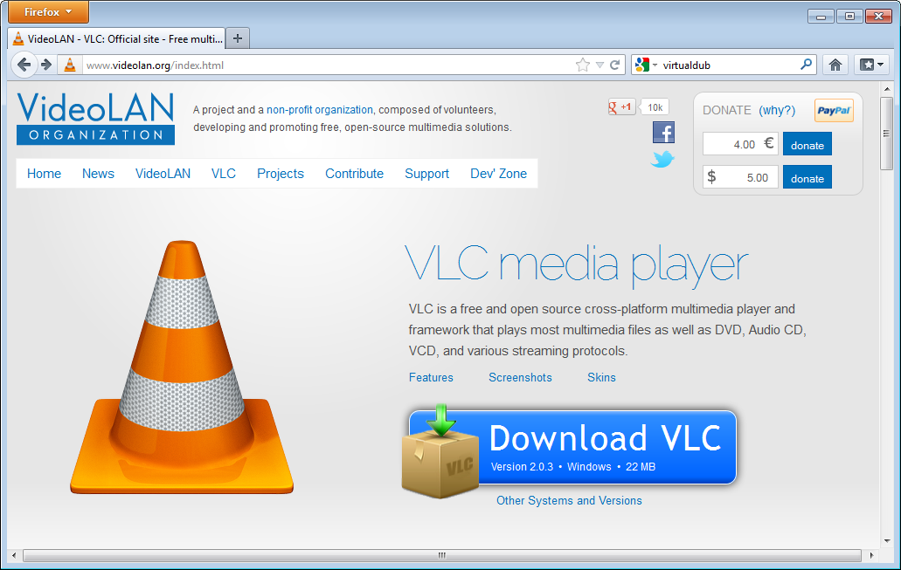
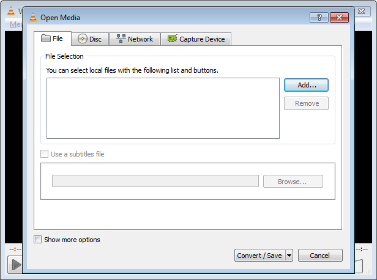
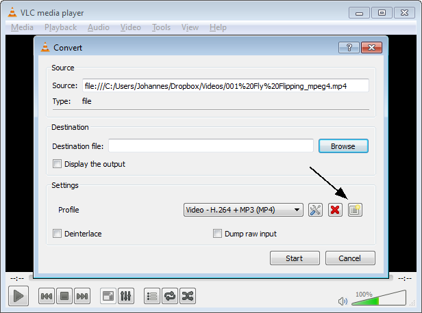
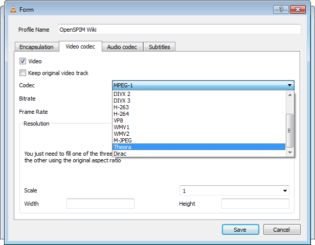
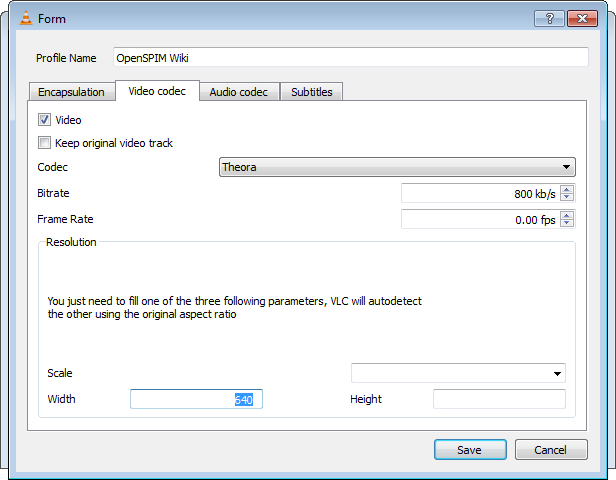

---
---
The OpenSPIM Wiki supports running Ogg videos embedded in the Wiki
pages. Although this is the most open, yet compact video format out
there, most consumer cameras do not support writing it, so you have to
convert the movies before uploading them to the Wiki.

# The easy way

Just update Fiji from the OpenSPIM update site and click the
*File\>Batch Convert Movies* menu item. It will ask you for an input
folder, where it expects only movies to be converted, and an output
folder, where it will put the corresponding *.ogv* files.

# The tedious way

If you insist on using VLC manually to convert movies to *.ogv* format,
you are certainly welcome to do that. Here is how:

## Download

First download [VLC](http://www.videolan.org/index.html):

## Start VLC

Now, start it from the Windows menu (make sure to use the unskinned
one):

## Choose *File\>Convert/Save*

Choose *Convert/Save* from the *Media* menu:

Add the file you want to convert by clicking on the ''Add' button:

### Making an *OpenSPIM Wiki* profile

If you have not done so yet, create a new profile for the format
required by this Wiki (it is the right-most button, indicated by the
arrow):

Let's call the profile *OpenSPIM Wiki* (the input box at the top of the
dialog). The encapsulation must be *.ogg* format:

The codec should be Ogg/Theora (if you want, you can choose a different
bit-rate, but it is not recommended):

On this Wiki, we like movies that are 640 pixels wide. As VLC states in
the comment, you can fill just one of the fields, the other are filled
in automatically, so let's choose 640 pixels width:

The audio codec should be Ogg/Vorbis:

Typically, 8 kilohertz is not quite a pleasure to listen to, so let's go
to 22 kilohertz sample rate:

## Choose the Profile

Even when you just created a profile, this is not selected by default,
so make sure that the OpenSPIM Wiki Profile is active:

# Choose the destination and start the conversion

Now you need to choose the destination (make sure that the file has the
extension *.ogg*, otherwise the Wiki might not grok it) and hit *Start*:

Now wait until the conversion is finished:

[Category:Tutorials](Category:Tutorials "wikilink")
