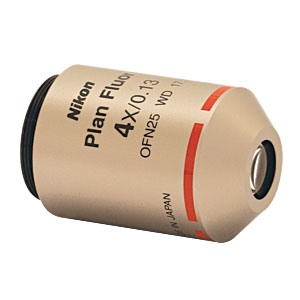
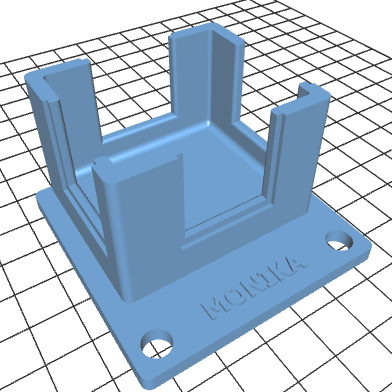

# OpenSPIM for brains setup built by Monika Pawłowska (Nencki Institute of Experimental Biology, Warsaw)

The table below lists the parts used by the OpenSPIM for brains setup built by Monika Pawłowska (Nencki Institute of Experimental Biology, Warsaw).

<table>
<tr class="header">
<th>Manufacturer</th>
<th>Accessibility</th>
<th>Description</th>
<th>File or Link/Model #</th>
<th>Image</th>
<th>Quantity</th>
<th>Price (EUR)</th>
</tr>
<tr class="odd">
<td>Nikon</td>
<td align="center" bgcolor="pink">purchase</td>
<td>4X Nikon Plan Fluorite Imaging Objective, 0.13 NA, 17.2 mm WD, dry</td>
<td><a href="https://www.thorlabs.de/thorproduct.cfm?partnumber=N4X-PF">N4X-PF</a></td>
<td align="center"></td>
<td align="center">2 (or 3 for double illumination)</td>
<td align-"center">410</td>
</tr>
<tr class="even">
<td>Thorlabs</td>
<td align="center" bgcolor="pink">purchase</td>
<td>Translating Lens Mount for Ø1" Optics (for the objectives)</td>
<td><a href="https://www.thorlabs.de/thorproduct.cfm?partnumber=LM1XY/M">LM1XY/M</a></td>
<td align="center">
<td align="center">2 or 3</td>
<td align="center">125</td>
</tr>
<tr class="odd">
<td>Nikon</td>
<td align="center" bgcolor="pink">purchase</td>
<td>Infinity-Corrected Tube Lens for Plan Fluorite Objectives</td>
<td><a href="https://www.thorlabs.de/thorproduct.cfm?partnumber=ITL200">ITL200</a></td>
<td align="center"></td>
<td align="center">1</td>
<td align="center">405</td>
</tr>
<tr class="even">
<td>Monika</td>
<td align="center" bgcolor="green">self made</td>
<td>This chamber can be 3D printed. For windows use 24x24 mm microscopy cover glasses and glue (eg. two component epoxy)</td>
<td><a href="https://github.com/openspim/openspim-parts/blob/master/Chambers/Dry_Objectives_Chamber_and_Holder/Chamber.stl">Chamber.stl</a></td>
<td align="center"></td>
<td align="center">1</td>
<td></td>
</tr>
<tr class="odd">
<td>Monika</td>
<td align="center" bgcolor="green">self made</td>
<td>This holder includes two threaded holes so it's easiest to make from metal (eg aluminum). Holder is mounted on the 4D stage arm with M6 screw. Glass slide with 1 mm thickness can be held with nylon or nylon-tipped screw</td>
<td>
<a href="https://github.com/openspim/openspim-parts/blob/master/Chambers/Dry_Objectives_Chamber_and_Holder/Metal_Holder.pdf">Metal_Holder.pdf</a> 
<a href="https://github.com/openspim/openspim-parts/blob/master/Chambers/Dry_Objectives_Chamber_and_Holder/Metal_Holder.step">Metal_Holder.step</a></td>
<td align="center"></td>
<td align="center">1</td>
<td></td>
</tr>
</table>
