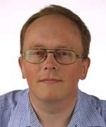
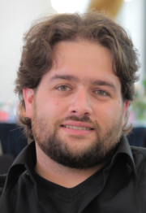
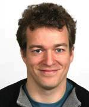
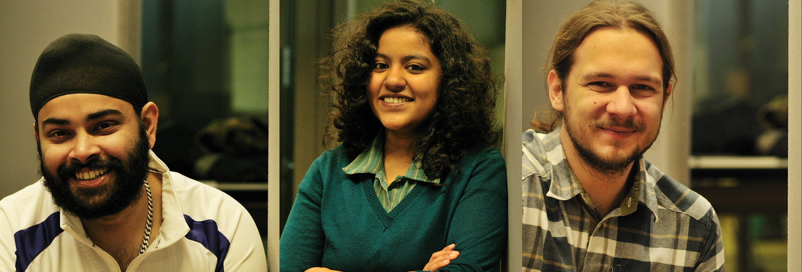

|                                                                      |                                          |                                                                                                                                                                                  |
| -------------------------------------------------------------------- | ---------------------------------------- | -------------------------------------------------------------------------------------------------------------------------------------------------------------------------------- |
|                                   | **Pavel Tomancak**                       | [Research Group Leader](http://www.mpi-cbg.de/research/research-groups/pavel-tomancak.html) at the MPI-CBG in Dresden. Provides ideas, concepts, research questions and funding. |
|                                         | **Jan Huisken**                          | [Research Group Leader](http://www.mpi-cbg.de/huisken) at the MPI-CBG in Dresden.                                                                                                |
|           | **Peter Gabriel Pitrone**                | Microscopy technician in the [Tomancak lab](http://www.mpi-cbg.de/research/research-groups/pavel-tomancak.html). Designed and built the OpenSPIM.                                |
|       | **Kevin Eliceiri**                       | Director of [LOCI](http://loci.wisc.edu/) University of Madison. Collaborator and provides live cell imaging expertise on Open SPIM project.                                     |
|                          | **Johannes Schindelin**                  | Senior Programmer at [LOCI](http://loci.wisc.edu/) University of Madison. Wrote the µManager OpenSPIM steering interface. Develops and maintains [Fiji](http://fiji.sc).         |
|  | **Luke Stuyvenberg**                     | Student Programmer at [LOCI](http://loci.wisc.edu/) University of Madison. Works on the µManager OpenSPIM steering interface.                                                    |
|                                            | **Michael Weber**                        | [PhD student](http://www.linkedin.com/profile/view?id=168139148) in the lab of [Jan Huisken](http://www.mpi-cbg.de/huisken). Provides feedback and SolidWorks renderings.        |
|                             | **Vineeth Surendranath**                 | PhD student in the [Tomancak lab](http://www.mpi-cbg.de/research/research-groups/pavel-tomancak.html). In charge of the photography for the OpenSPIM project.                    |
|                      | **Stephan Preibisch**                    | Former PhD student in Tomancak lab now post-doc in [Gene Myers group](http://research.janelia.org/myers/). Develops SPIM related image processing approaches for Fiji.           |
|                          | **Sukhdeep Singh, Sonal, Steve Simmert** | PhD students at the [BIOTEC](http://www.biotec.tu-dresden.de/) in Dresden. Put together the OpenSPIM Wiki during the 2011 pre-doc course in the Tomancak lab.                    |
|                                                                      |                                          |                                                                                                                                                                                  |

[Category:People](Category:People "wikilink")
