

<b>Disclaimer</b>  
When building and working with OpenSPIM it is your own responsibility to make a risk assessment before starting any procedure and on the basis of the risk assessment to make sure appropriate safety precautions are taken to avoid damage to any person or property.

Inform yourself about the manufacturers instructions for all parts used for the openSPIM before you start assembling the OpenSPIM.

Follow all instructions in the manufacturer’s operator’s manuals, especially the safety precautions.

We take no liability for any personal or property damage caused by the openSPIM or any parts described on this page.

Warning: Depending on the laser class of the laser, the laser beam or even scattered light from the laser may be extremely harmful to eyes and skin. Some lasers can potentially cause blindness after direct eye contact.

Before you start to assemble please make sure you have all <a href="Table_of_parts">needed parts</a> or you know how to improvise them. The light path of our original design is 50 mm off the top surface of the ThorLabs metric optical breadboard (part #: MB3045/M) where everything is installed.

<b> The optical breadboard has a length of 300 mm and a width of 450 mm, with a grid of 12 x 18 M6 threaded holes spaced 25 mm apart from one another. We will use a coordinate system similar to a spreadsheet </b>(like OpenOffice Calc or Microsoft Excel)<b> to make it easier to know where each component and cap screw is positioned. Starting with A1 in the upper left corner </b>(as seen in the images)<b>, and ending with R12 in the lower right.</b>

Please also forgive the confusion about the Youtube videos and the corresponding images, the documentation was done in two different locations months apart from each other and small design changes happened in between.

  - [Assemble purchased components](Assemble_purchased_components)
  - [Install assembled ThorLabs components on rail carriers](Install_assembled_ThorLabs_components_on_rail_carriers)
  - [Install illumination axis on the optical breadboard - Part 1](Install_illumination_axis_on_the_optical_breadboard_-_Part_1)
  - [Alignment of laser](Alignment_of_laser)
  - [Install illumination axis on the optical breadboard - Part 2](Install_illumination_axis_on_the_optical_breadboard_-_Part_2)
  - [Install detection axis on the optical breadboard](Install_detection_axis_on_the_optical_breadboard)
  - [Install the 4D motor system](Install_the_4D_motor_system)
  - [Install cables and connect computer](Install_cables_and_connect_computer)

There is a short introduction to the optics of a SPIM available as the [SPIM Optics 101](SPIM_Optics_101). This will also give practical hints for optics alignment and laser safety.

## Assembly overview

[OpenSPIM buildup SolidWorks and real](images/Combined_solidworks_real_registered_640.gif "OpenSPIM buildup SolidWorks and real")

<table>
<tr>
<th width="30" align="center">Step</th>
<th align="center">Description</th>
<th align="center">SolidWorks rendering</th>
<th align="center">Real Picture</th>
<th align="center">Video Tutorial</th>
</tr>
<tr bgcolor="lightgray">
<td align="center"><b>1</b></td>
<td align="center"><a href="Install_illumination_axis_on_the_optical_breadboard_-_Part_1#Install_1"_mirror_assembly_and_its_spacer_post">Install corner mirror</a></td>
<td align="center"></td>
<td align="center"></td>
<td align="center"><a href="https://youtu.be/IU9aeoVezRY"</a>Installing large mirror mount on the optical breadboard</a></td>
</tr>
<tr>
<td align="center"><b>2</b></td>
<td align="center"><a href="Install_illumination_axis_on_the_optical_breadboard_-_Part_1#Install_the_CUBE_laser_heatsink">Install laser heatsink</a></td>
<td align="center"></td>
<td align="center"></td>
<td align="center"><a href="https://youtu.be/2Yq3PTbr9sU"</a>Installing laser with heatsink on the optical breadboard</a></td>
</tr>
<tr bgcolor="lightgray">
<td align="center"><b>3<b></td>
<td align="center"><a href="Install_illumination_axis_on_the_optical_breadboard_-_Part_1#Mount_the_laser_on_the_laser_heat_sink">Install laser</a></td>
<td align="center">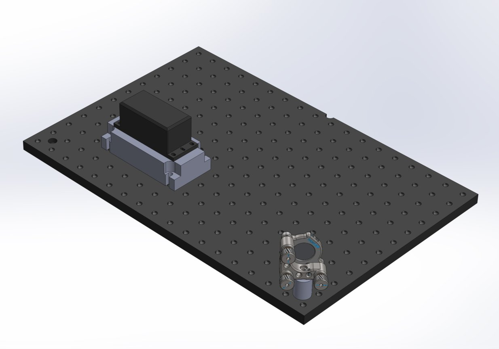</td>
<td align="center">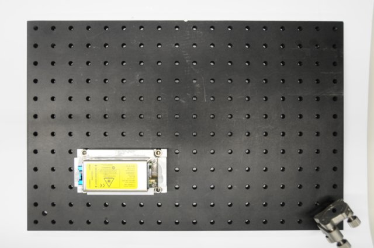</td>
<td align="center"><a href="https://youtu.be/EWHls5ALmwY">Installing laser onto the laser base</a></td>
</tr>
<tr>
<td align="center"><b>4<b></td>
<td align="center"><a href="Install_illumination_axis_on_the_optical_breadboard_-_Part_1#Mount_dovetail_rails_onto_optical_breadboard)">Installing rails"</a></td>
<td align="center"></td>
<td align="center"></td>
<td align="center"><a href="https://youtu.be/v6zzWuyd0JE">Installing dovetail rails onto the optical breadboard]</a></td>
</tr>
<tr bgcolor="lightgray">
<td align="center"><b>5<b></td>
<td align="center"><a href="Install_illumination_axis_on_the_optical_breadboard_-_Part_1#Install_both_1/2"_mirror_assemblies_on_rail_system)">Installing laser bouncing mirrors</a></td>
<td align="center"> 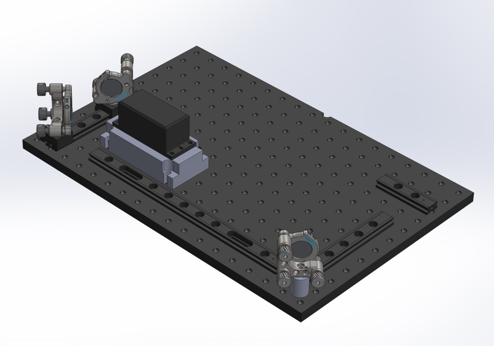</td>
<td align="center"> </td>
<td align="center"><a href="https://youtu.be/PrXBnJcvaqI">Installing small mirror assemblies onto the dovetail rail system<a></td>
</tr>
<tr>
<td align="center"><b>6<b></td>
<td align="center"><a href="Install_illumination_axis_on_the_optical_breadboard_-_Part_1#Install_the_OpenSPIM_chamber">Installing sample chamber</a></td>
<td align="center"> 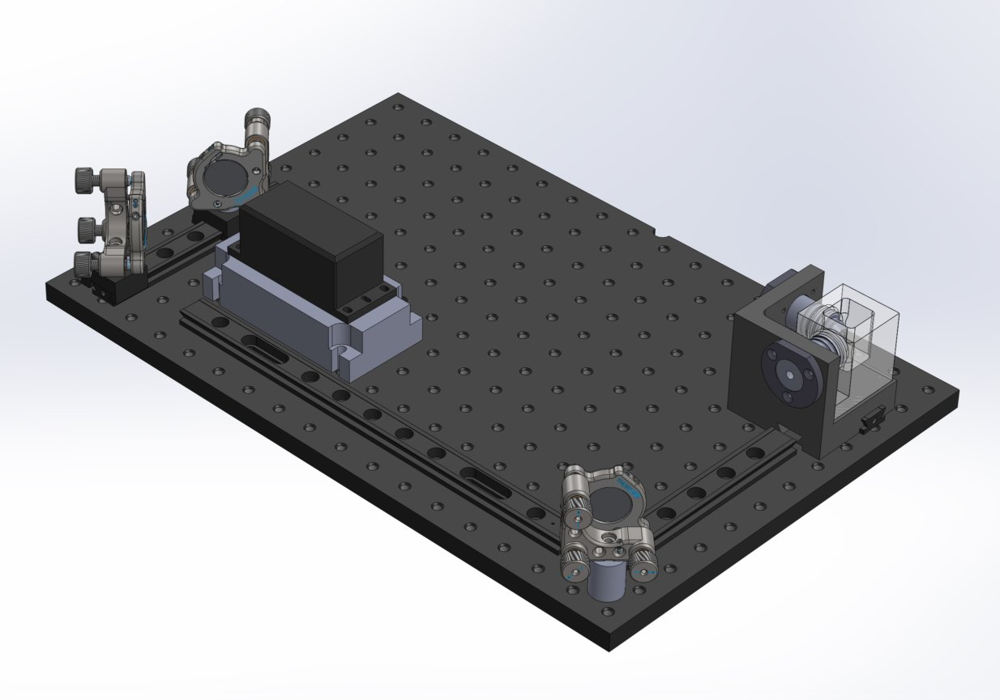</td>
<td align="center"> </td>
<td align="center"><a href="https://youtu.be/blgEtuH6pN0">Installing the SPIM chamber assembly onto the dovetail rail system</a></td>
</tr>
<tr bgcolor="lightgray">
<td align="center"><b>7<b></td>
<td align="center"><a href="Alignment_of_laser">Align the laser</a></td>
<td align="center"></td>
<td align="center"></td>
<td align="center"><a href="https://youtu.be/Mn11Qq1ovwo">Aligning the laser</a></td></tr>
</tr>
<tr>
<td align="center"><b>8<b></td>
<td align="center"><a href="Install_illumination_axis_on_the_optical_breadboard_-_Part_2#Assembling_the_beam_expander">Installing beam expander</a></td>
<td align="center">
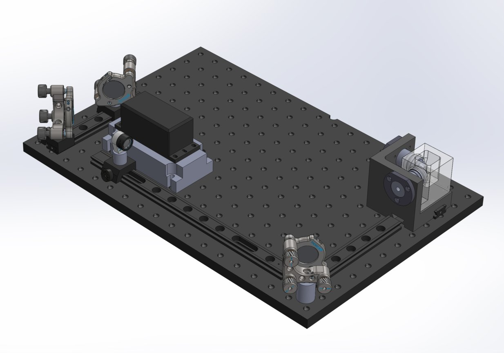 
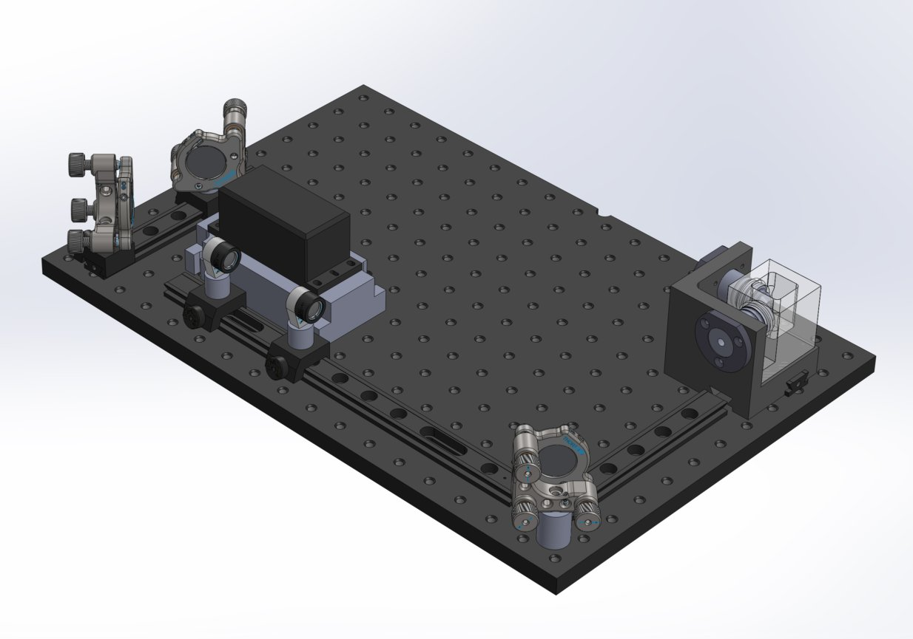
</td>
<td align="center">
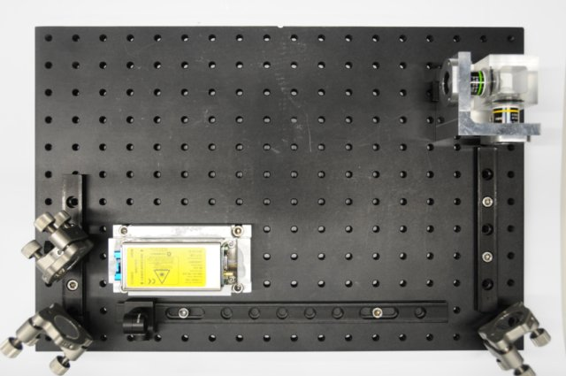 

</td>
<td align="center"><a href="https://youtu.be/vfcUg3S5EB0">Installation of beam expander</a></td>
</tr>
<tr bgcolor="lightgray">
<td align="center"><b>9<b></td>
<td align="center"><a href="Install_illumination_axis_on_the_optical_breadboard_-_Part_2#Install_the_cylindrical_lens_in_it's_proper_place">Install cylindrical lens<a></td>
<td align="center">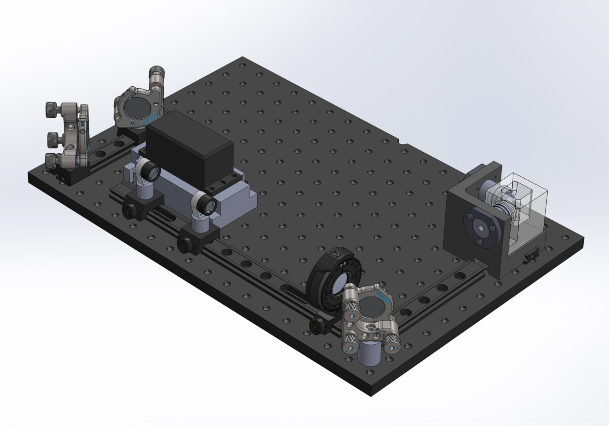</td>
<td align="center">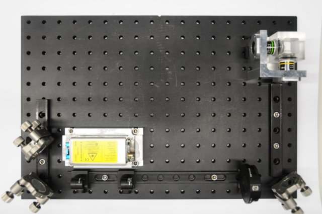</td>
<td align="center"><a href="https://youtu.be/3PYxr6gdul8">Installing the cylindrical lens<a></td>
</tr>
<tr>
<td align="center"><b>10</b></td>
<td align="center"><a href="Install_illumination_axis_on_the_optical_breadboard_-_Part_2#Install_the_vertical_slit_in_it's_proper_place">Install vertical slit</a></td>
<td align="center"></a></td>
<td align="center">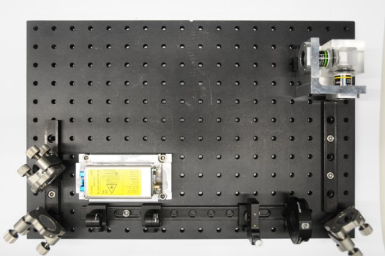</a></td>
<td align="center"><a href="https://youtu.be/oQ56PAx1-co">Installing the vertical slit</a></td>
</tr>
<tr bgcolor="lightgray">
<td align="center"><b>11</b></td>
<td align="center"><a href="Install_illumination_axis_on_the_optical_breadboard_-_Part_2#Assembling_the_telescope">Install the telescope</a></td>
<td align="center">
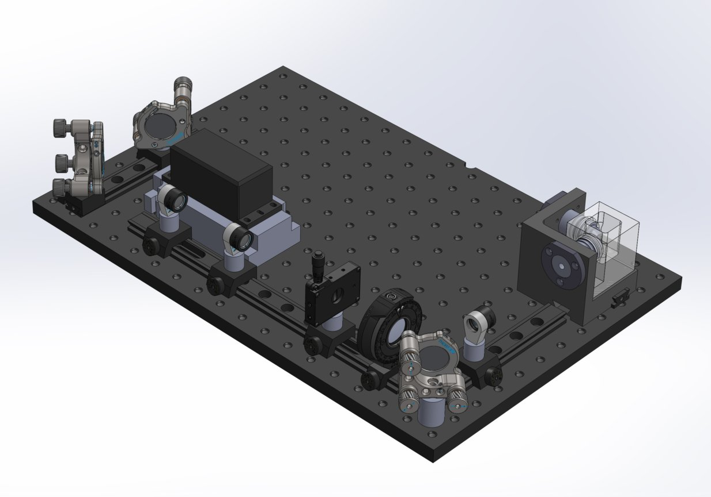 

</td>                                                                                      
<td align="center">
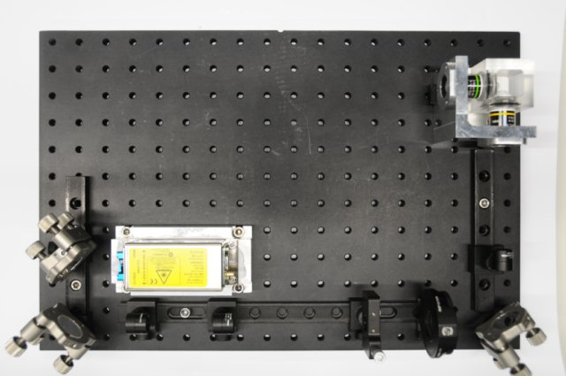 

</td>
<td align="center"><a href="https://youtu.be/02jJLsIvWb8">Installing the telescope</a></td>
</tr>
<tr>
<td align="center"><b>12</b></td>
<td align="center"><a href="Install_detection_axis_on_the_optical_breadboard#Assembly_of_detection_axis">Install the detection axis base</a></td>
<td align="center">
 

</td>
<td align="center">
 

</td>
<td align="center">
<a href="https://youtu.be/aIjahE1SpZQ">Installing the detection axis holder base</a> 
<a href="https://youtu.be/u5nKH43C6i4">Installing the detection axis holder base (take 2)</a>
</td>
</tr>
<tr bgcolor="lightgray">
<td align="center"><b>13</b></td>
<td align="center"><a href="Install_detection_axis_on_the_optical_breadboard#Camera_installation">Install the camera</a></td>
<td align="center">
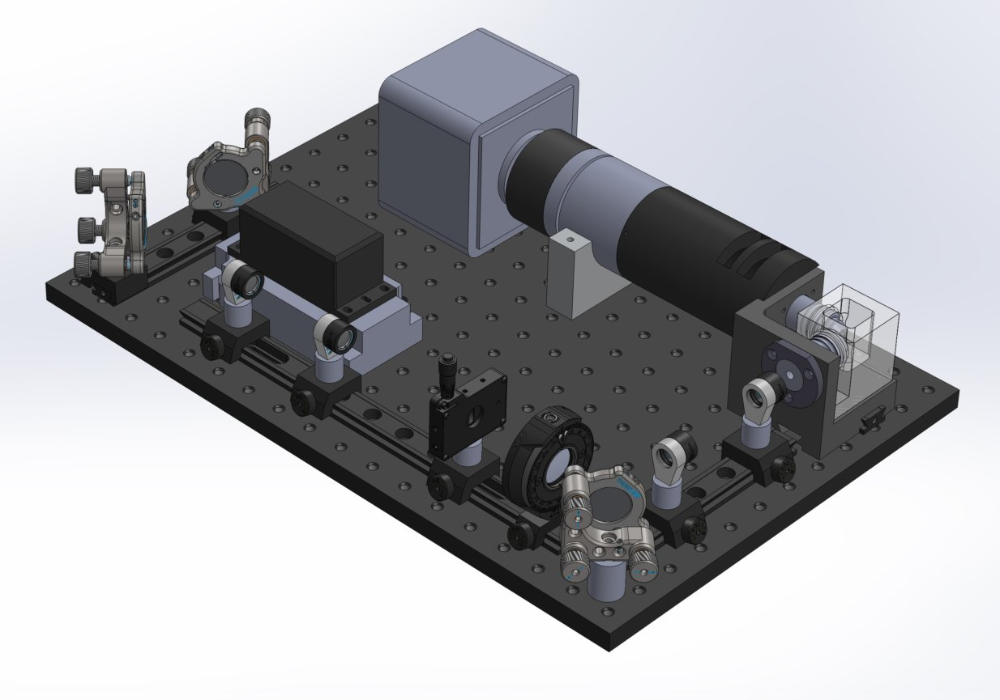 
</td>
</td>
<td align="center">
 

</td>
<td align="center"><a href="https://youtu.be/aIjahE1SpZQ">Install detection axis holder base<a></td>
</tr>
<tr>
<td align="center"><b>14<b></td>
<td align="center"><a href="Install_the_4D_motor_system">Install the 4D motor system</a></td>
<td align="center">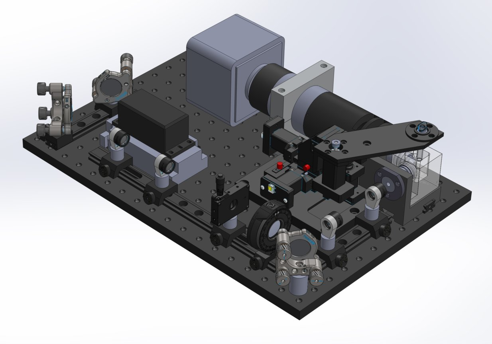</td>
<td align="center">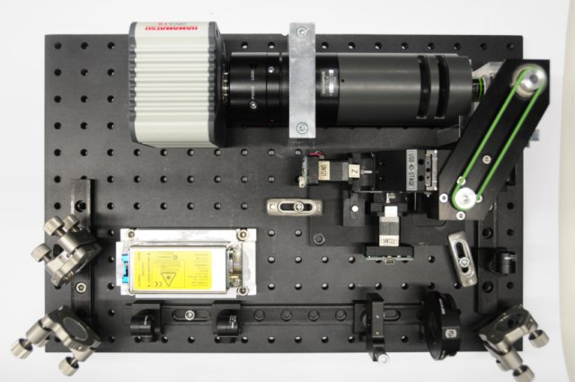</td>
<td align="center"><a href="https://youtu.be/vM9rxiuzTZs">Installing the 4D motors</a></td>
</tr>
</table>

Now <a href="Install_cables_and_connect_computer">connect the system to the computer</a></td> and you are ready for <a href="Operation">operation</a>.
