---
---
 All OpenSPIM designed parts need to be
double checked for tolerances if you will be 3D printing
them!! Having a well trained machinist is an invaluable
resource, we recommend that you purchase all of your parts first and
then have your OpenSPIM designed parts made to fit afterwards by someone
with experience!!

(Pieter Fourie Design and Engineering has made parts for multiple
OpenSPIM systems, a link to write an email is beside all self made parts
in the list below in the price column)

## Illumination Parts List

<table>
<tr class="header">
<th>Manufacturer</th>
<th>Accessibility</th>
<th>Description</th>
<th>File or Link/Model #</th>
<th>Image</th>
<th>Quantity</th>
<th>Price (EUR)</th>
</tr>
<tr class="odd">
<td>
Cobolt 
Coherent 
Omicron 
Vortran
</td>
<td bgcolor="pink">purchase</td>
<td>
Whichever wavelength &amp; mW is necessary for your experiments. 
 
<em>Note: the <strong>Cobolt MLD 488</strong>, <strong>Coherent Obis 488 LX</strong>, <strong>Omicron LuxX488-60</strong>, and <strong>Vortran Stradus 488-50</strong> packages include the laser unit, control box, interface cable &amp; power supply.</em> 
 
<em>Note: For two-color SPIM, the <strong>Omicron LightHUB-2</strong> or <strong>Vortran VersaLase</strong> are available. Modification of the optical layout is required to accommodate the package size.</em>
</td>
<td>
<a href="https://hubner-photonics.com/products/lasers/diode-lasers/06-01-series/">Cobolt MLD488</a> 
<a href="https://www.coherent.com/lasers?2004/obis-laser-system">Obis 488 LX</a> 
<a href="https://www.omicron-laser.de/english/lasers/diode-lasers/luxx-lasers/luxx-diode-lasers.html">LuxX 488-60</a> 
<a href="http://www.vortranlaser.com/index.php/products-main/stradus-diode-laser-modules/blue">Stradus 488-50</a> 
<a href="https://www.omicron-laser.de/english/light-engines/lighthub-laser-combiners/lighthub-laser-combiners.html">LightHUB</a> 
<a href="http://www.vortranlaser.com/">VersaLase</a>
</td>
<td align="center">
 
  
</td>
<td align="center">1</td>
<td align="center">~7000</td>
</tr>
<tr class="even">
<td>OpenSPIM</td>
<td align="center" bgcolor="green">self made</td>
<td>
The <strong>heat sink</strong> brings the laser to the desired height of 50 mm off the surface of the optical breadboard  
 Must be made out of a heat conducting material. We use Aluminum.
</td>
<td>
<a href="models/OpenSPIM_Cube-Laser_Heatsink.STL">Heatsink.stl</a> 
<a href="models/OpenSPIM_Cube-Laser_Heatsink.STEP">Heatsink.step</a> 
<a href="documents/OpenSPIM_Cube-Laser_Heatsink.PDF">Heatsink.pdf</a>
</td>
<td align="center">
<td align="center">1</td>
<td align="center">70, <a href="mailto:wwwpfdecouk@gmail.com?Subject=Production%20of%20___%20laser%20heatsink%20for%20the%20OpenSPIM%20system">email vendor</a>
</td>
</tr>
<tr class="odd">
<td>ThorLabs</td>
<td align="center" bgcolor="pink">purchase</td>
<td>
1/2" (Ø12.7 mm) SM05-Mounted Frosted Glass <strong>Alignment Disk</strong> w/Ø1 mm Hole 
 
<em>Note: for use in aligning the illumination beam path</em>
</td>
<td><a href="https://www.thorlabs.de/newgrouppage9.cfm?objectgroup_id=3855&pn=DG05-1500-H1-MD#4816">DG05-1500-H1-MD</a></td>
<td align="center">
<td align="center">2</td>
<td align="center">25</td>
</tr>
</table>

## Opto-mechanical parts list

<table>
<tr class="header">
<th>Manufacturer</th>
<th>Accessibility</th>
<th>Description</th>
<th>File or Link/Model #</th>
<th>Image</th>
<th>Quantity</th>
<th>Price (EUR)</th>
</tr>
<tr class="odd">
<td>ThorLabs</td>
<td align="center" bgcolor="pink">purchase</td>
<td>The metric (M6 tapped 25 mm spacing) <strong>optical bread board</strong> that the OpenSPIM system is installed on</td>
<td><a href="https://www.thorlabs.de/newgrouppage9.cfm?objectgroup_id=159&pn=MB3045/M#1996">MB3045/M</a></td>
<td align="center">
<td align="center">1</td>
<td align="center">185</td>
</tr>
<tr class="even">
<td>ThorLabs</td>
<td align="center" bgcolor="pink">purchase</td>
<td>Metric Dovetail Optical <strong>Rail, 300 mm</strong> 
 
<em>plus 2x M6 x 12mm cap screws</em></td>
<td><a href="https://www.thorlabs.de/newgrouppage9.cfm?objectgroup_id=30&pn=RLA300/M#8294">RLA300/M</a></td>
<td align="center">

<td align="center">1</td>
<td align="center">65</td>
</tr>
<tr class="odd">
<td>ThorLabs</td>
<td align="center" bgcolor="pink">purchase</td>
<td>Metric Dovetail Optical <strong>Rail, 150 mm</strong> 
 
<em>plus (at least) 2x M6 x 12mm cap screws for each</em></td>
<td><a href="https://www.thorlabs.de/newgrouppage9.cfm?objectgroup_id=30&pn=RLA150/M#8294">RLA150/M</a></td>
<td align="center">
<td align="center">2</td>
<td align="center">35</td>
</tr>
<tr class="even">
<td>ThorLabs</td>
<td align="center" bgcolor="pink">purchase</td>
<td>Metric Dovetail Optical <strong>Rail, 75 mm</strong> 
 
<em>plus 2x M6 x 12mm cap screws</em></td>
<td><a href="https://www.thorlabs.de/newgrouppage9.cfm?objectgroup_id=30&pn=RLA075/M#8294">RLA075/M</a></td>
<td align="center">
<td align="center">1</td>
<td align="center">25</td>
</tr>
<tr class="odd">
<td>ThorLabs</td>
<td align="center" bgcolor="pink">purchase</td>
<td><strong>Rail carrier</strong> 1" (Ø25.4 mm) 
 
<em><a href="https://www.thorlabs.de/newgrouppage9.cfm?objectgroup_id=5894&pn=SD1#247">SD1</a> Can buy 1 but it wouldn't hurt to buy a 10 pack</em></td>
<td><a href="https://www.thorlabs.de/newgrouppage9.cfm?objectgroup_id=8295&pn=RC1#8296">RC1</a></td>
<td align="center">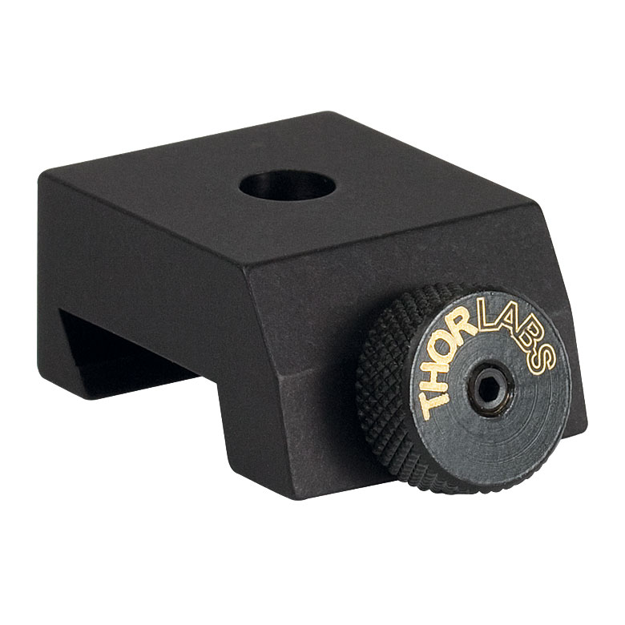
<td align="center">8</td>
<td align="center">20</td>
</tr>
<tr class="even">
<td>OpenSPIM</td>
<td align="center" bgcolor="green">self made</td>
<td>The <strong>RC1 vertical slit stilt</strong> elevates the center of the vertical slit 13.17 mm from the rail carrier to the desired height of 50 mm off the surface of the optical breadboard 
 
<em>plus 1x M4 x 22* mm capscrew</em> 
 
<strong>*cut a M4 x 25 mm down to size</strong></td>
<td><a href="models/OpenSPIM_Stilt_Vertical-slit.STL">13.17 mm.stl</a> 
<a href="models/OpenSPIM_Stilt_Vertical-slit.STEP">13.17 mm.step</a> 
<a href="documents/Vertical-slit_rail-carrier_stilt_13-17mm.PDF">13.17 mm.pdf</a></td>
<td align="center">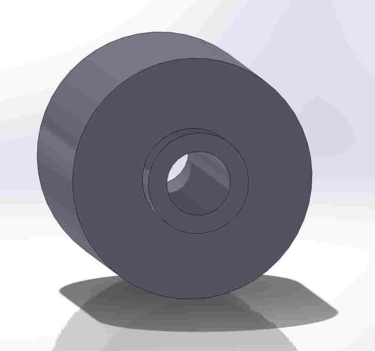
<td align="center">1</td>
<td align="center">35, <a href="mailto:wwwpfdecouk@gmail.com?&amp;Subject=Production%20of%20___%2013.17%20mm%20tall%20stilt%20for%20the%20vertical%20slit%20for%20the%20OpenSPIM%20system">email vendor</a></td>
</tr>
<tr class="odd">
<td>ThorLabs</td>
<td align="center" bgcolor="pink">purchase</td>
<td>Adjustable mechanical slit</td>
<td><a href="https://www.thorlabs.de/newgrouppage9.cfm?objectgroup_id=1465&pn=VA100/M#1465">VA100/M</a></td>
<td align="center">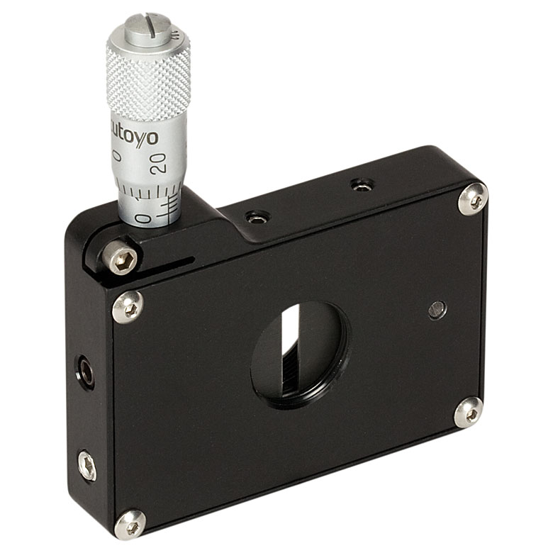
<td align="center">1</td>
<td align="center">220</td>
</tr>
<tr class="even">
<td>OpenSPIM</td>
<td align="center" bgcolor="green">self made</td>
<td>The <strong>RC1 Ø1/2" lens stilt</strong> elevates the center of the Ø1/2" (Ø12.7 mm) lenses 14.95 mm from the rail carrier to the desired height of 50 mm off the surface of the optical breadboard 
 
<em>plus 1x M4 x 25 mm capscrew for each</em> 
 
<em>Note: One could also buy a pack or two of <a href="https://www.thorlabs.de/newgrouppage9.cfm?objectgroup_id=234&pn=SC1/M#2332">SC1/M</a>'s and trim off 0.05 mm, but it might not be such an easy task</em></td>
<td><a href="models/OpenSPIM_Stilt_1-2in-Lens.STL">14.95 mm.stl</a> 
<a href="models/OpenSPIM_Stilt_1-2in-Lens.STEP">14.95 mm.step</a> 
<a href="documents/OpenSPIM_Stilt_1-2in-Lens.PDF">14.95 mm.pdf</a></td>
<td align="center">
<td align="center">6</td>
<td align="center">35, <a href="mailto:wwwpfdecouk@gmail.com?&amp;Subject=Production%20of%20___%2014.95%20mm%20tall%20stilt%20for%20the%20Ø1/2%20inch%20lensmount%20for%20the%20OpenSPIM%20system">email vendor</a></td>
</tr>
<tr class="odd">
<td>ThorLabs</td>
<td align="center" bgcolor="pink">purchase</td>
<td>Ø1/2" (Ø12.7 mm) optic mount</td>
<td><a href="https://www.thorlabs.de/newgrouppage9.cfm?objectgroup_id=1433&pn=LMR05/M#9543">LMR05/M</a></td>
<td align="center">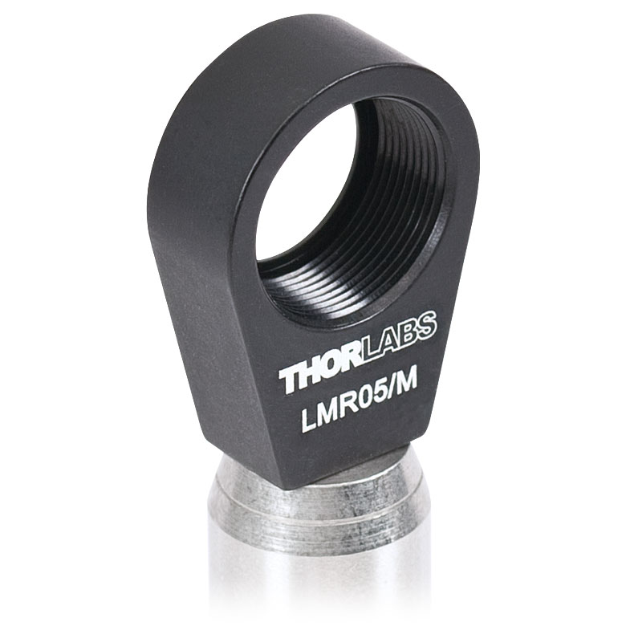
<td align="center">6</td>
<td align="center">15</td>
</tr>
<tr class="even">
<td>OpenSPIM</td>
<td align="center" bgcolor="green">self made</td>
<td>The <strong>RC1 Ø1" mirror stilt</strong> elevates the center of the Ø1" (Ø25.4 mm) Polaris mirror mounts 5.5 mm from the rail carrier to the desired height of 50 mm off the surface of the optical breadboard 
 
<em>plus 1x M4 x 20 mm capscrews and 1x M4 nut for each</em></td>
<td><a href="models/OpenSPIM_Stilt_1-2in-Mirror.STL">5.5 mm.stl</a> 
<a href="models/OpenSPIM_Stilt_1-2in-Mirror.STEP">5.5 mm.step</a> 
<a href="documents/Mirror_rail-carrier_stilt_5-5mm.PDF">5.5 mm.pdf</a></td>
<td align="center">
<td align="center">2</td>
<td align="center">35, <a href="mailto:wwwpfdecouk@gmail.com?&amp;Subject=Production%20of%20___%205.5%20mm%20mirror%20stilt%20for%20the%20Ø1%20inch%20mirrors%20on%20a%20slider%20for%20the%20OpenSPIM%20system">email vendor</a></td>
</tr>
<tr class="odd">
<td>ThorLabs</td>
<td align="center" bgcolor="yellow">modify</td>
<td>Modified Rail carrier 15.4 mm for the cylindrical lens rotation mount 
 
<em>Note: made from one of the RC1's</em></td>
<td><a href="documents/MODIFIED_ThorLabs_RC1-M_Rail-Carrier_for_Dovetail-Optical-Rail.PDF">RC1 mod.pdf</a></td>
<td align="center">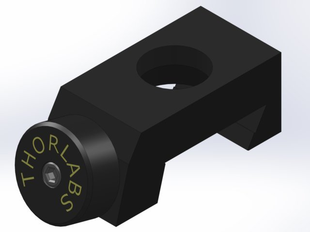
<td align="center">1</td>
<td align="center"> </td>
</tr>
<tr class="even">
<td>ThorLabs</td>
<td align="center" bgcolor="pink">purchase</td>
<td>Metric Rotation Mount for Ø1" (Ø25.4 mm) optics, 360° Continuous or 15° Indexed Rotation</td>
<td><a href="https://www.thorlabs.de/newgrouppage9.cfm?objectgroup_id=246&pn=RSP1X15/M#3668">RSP1X15/M</a></td>
<td align="center">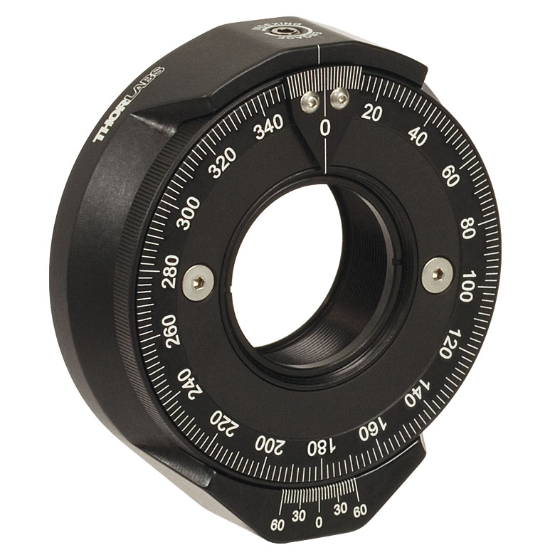
<td align="center">1</td>
<td align="center">110</td>
</tr>
<tr class="odd">
<td>OpenSPIM</td>
<td align="center" bgcolor="green">self made</td>
<td>The <strong>Ø1" mirror stand</strong> elevates the center of the Ø1" (Ø25.4 mm) mirror mount 24.55 mm to the desired height of 50 mm off the surface of the optical breadboard 
 
<em>plus 1x M4 x 45 mm capscrew and 1x M4 nut</em></td>
<td><a href="models/OpenSPIM_Stilt_1in-Mirror.STL">24.55 mm.stl</a> 
<a href="models/OpenSPIM_Stilt_1in-Mirror.STEP">24.55 mm.step</a> 
<a href="documents/OpenSPIM_Stilt_1in-Mirror.PDF">24.55 mm.pdf</a></td>
<td align="center">
<td align="center">1</td>
<td align="center">35, <a href="mailto:wwwpfdecouk@gmail.com?&amp;Subject=Production%20of%20___%2024.55%20mm%20tall%20mirror%20stilt%20for%20the%20OpenSPIM%20system">email vendor</a></td>
</tr>
<tr class="even">
<td>ThorLabs</td>
<td align="center" bgcolor="pink">purchase</td>
<td>POLARIS-K1 - PolarisTM Low Drift Ø1" (Ø25.4 mm) Kinematic Mirror Mount 
 
<em>Note: it is recommended to use the K1-H for the 2 mirrors closest to the laser</em></td>
<td><a href="https://www.thorlabs.de/newgrouppage9.cfm?objectgroup_id=3912&pn=POLARIS-K1#4258">POLARIS-K1</a> 
<a href="https://www.thorlabs.de/newgrouppage9.cfm?objectgroup_id=3912&pn=POLARIS-K1-H#4258">POLARIS-K1-H</a></td>
<td align="center">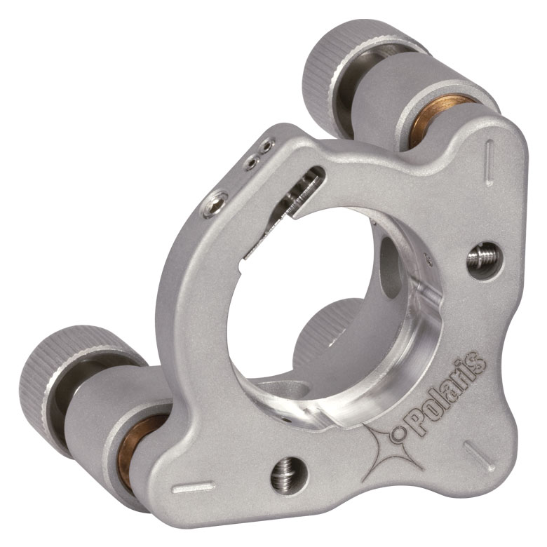
<td>3</td>
<td>115</td>
</tr>
</table>

## Illumination Axis Optical Components List

## Opto-mechanical parts list

<table>
<tr class="header">
<th>Manufacturer</th>
<th>Accessibility</th>
<th>Description</th>
<th>File or Link/Model #</th>
<th>Image</th>
<th>Quantity</th>
<th>Price (EUR)</th>
</tr>
<tr class="odd">
<td>ThorLabs</td>
<td align="center" bgcolor="pink">purchase</td>
<td><b>Ø1/2" (Ø12.7 mm) Achromatic Doublet</b>, SM05-Threaded Mount, <i>f</i> = 50 mm, ARC: 400 - 700 nm</td>
<td><a href="https://www.thorlabs.de/newgrouppage9.cfm?objectgroup_id=2696&pn=AC127-050-A-ML#3443">AC127-050-A-ML</a></td>
<td align="center">
</td>
<td align="center">2</td>
<td align="center">65</td>
</tr>
<tr class="even">
<td>ThorLabs</td>
<td align="center" bgcolor="pink">purchase</td>
<td><b>Ø1/2" (Ø12.7 mm) Achromatic Doublet</b>, SM05-Threaded Mount, <i>f</i> = 25 mm, ARC: 400 - 700 nm</td>
<td><a href="https://www.thorlabs.de/newgrouppage9.cfm?objectgroup_id=2696&pn=AC127-025-A-ML#3443">AC127-025-A-ML</a></td>
<td align="center"></td>
<td align="center">2</td>
<td align="center">65</td>
</tr>
<tr class="odd">
<td>ThorLabs</td>
<td align="center" bgcolor="pink">purchase</td>
<td><b>Ø1" (Ø25.4 mm) Cylindrical Achromat</b>, <i>f</i> = 50 mm, ARC: 350 - 700 nm</td>
<td><a href="https://www.thorlabs.de/newgrouppage9.cfm?objectgroup_id=5528&pn=ACY254-050-A#5530">ACY254-050-A</a></td>
<td align="center">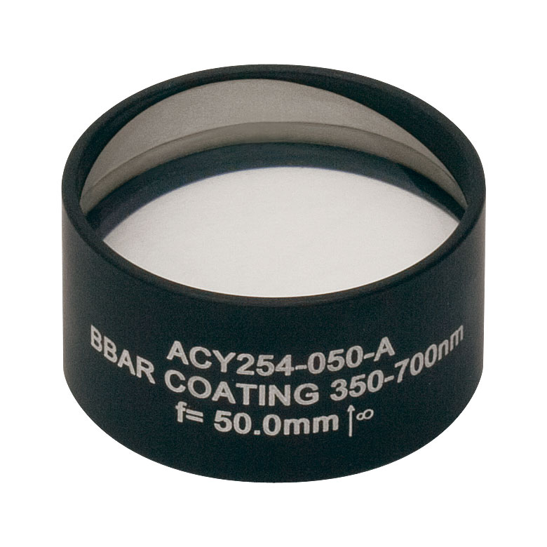</td>
<td align="center">1</td>
<td align="center">315</td>
</tr>
<tr class="even">
<td>Olimpus</td>
<td align="center" bgcolor="pink">purchase</td>
<td>Water dipping <b>objective lens for illumination</b> (10x/0.3)</td>
<td><a href="https://www.olympus-lifescience.com/en/objectives/detail/0-DIRECTORY%3A%3ADirFrontend-itemId.511706538.html">UMPLFLN 10XW"</a></td>
<td align="center"></td>
<td align="center">1</td>
<td align="center">900</td>
</tr>
</table>

## SPIM Chamber Parts List

<table>
<tr class="header">
<th>Manufacturer</th>
<th>Accessibility</th>
<th>Description</th>
<th>File or Link/Model #</th>
<th>Image</th>
<th>Quantity</th>
<th>Price (EUR)</th>
</tr>
<tr class="odd">
<td>OpenSPIM</td>
<td align="center" bgcolor="green">self made</td>
<td>milled <strong>acrylic sample chamber</strong> that holds the two Olympus water dipping objectives in a perpendicular arrangement to illuminate and observe the sample 
 
<em>plus two M6 x 12mm screws</em></td>
<td><a href="models/OpenSPIM_SPIM-Chamber.STL">Sample Chamber.stl</a> 
<a href="models/OpenSPIM_SPIM-Chamber.STEP">Sample Chamber.step</a> 
<a href="documents/OpenSPIM_SPIM-Chamber.PDF">Sample Chamber.pdf</a></td>
<td align="center">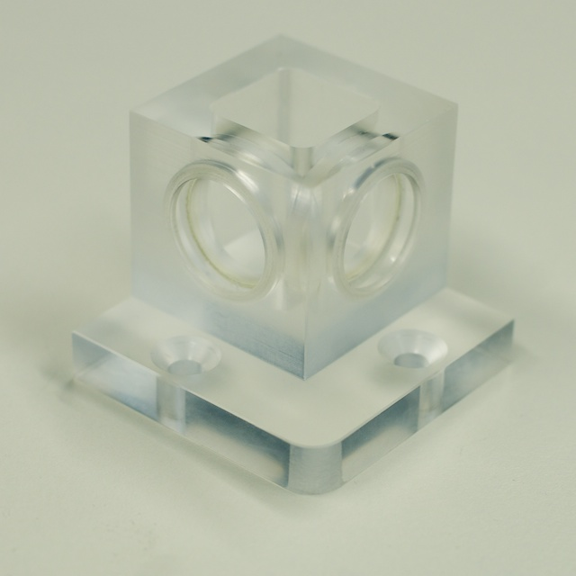
<td align="center">1</td>
<td align="center"><a href="mailto:wwwpfdecouk@gmail.com?&amp;Subject=Production%20of%20___%20sample%20chamber%20for%20the%20OpenSPIM%20system">Email vendor</a>, 135</td>
</tr>
<tr class="even">
<td>OpenSPIM</td>
<td align="center" bgcolor="green">self made</td>
<td><strong>metal holder</strong> for the acrylic sample chamber (Note:both stl and pdf don't contain dimensions for the M3 holes)</td>
<td><a href="models/OpenSPIM_SPIM-Chamber_Holder.STL">Chamber Holder.stl</a> 
<a href="models/OpenSPIM_SPIM-Chamber_Holder.STEP">Chamber Holder.step</a> 
<a href="documents/OpenSPIM_SPIM-Chamber_Holder.PDF">Chamber Holder.pdf</a></td>
<td align="center">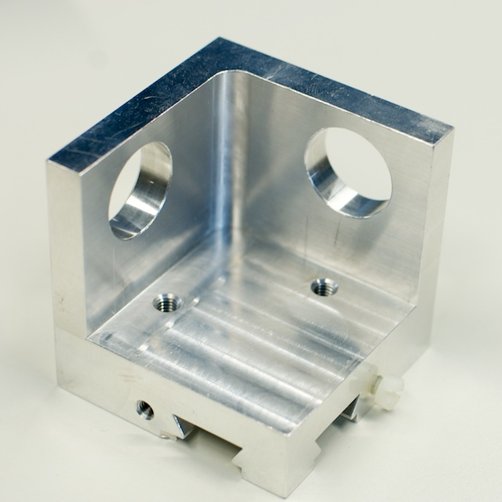
<td align="center">1</td>
<td align="center">200, <a href="mailto:wwwpfdecouk@gmail.com?&amp;Subject=Production%20of%20___%20sample%20chamber%20base%20for%20the%20OpenSPIM%20system">email vendor</a></td>
</tr>
<tr class="odd">
<td>OpenSPIM</td>
<td align="center" bgcolor="green">self made</td>
<td>metal <strong>objective holder ring</strong> attaching the illumination and detection lens to the metal sample chamber holder. 
 
<em>plus three M3 x 8 mm screws for each</em></td>
<td><a href="models/OpenSPIM_SPIM-Chamber_Objective-Ring.STL">Objective Ring.stl</a> 
<a href="documents/OpenSPIM_SPIM-Chamber_Objective-Ring.PDF">Objective Ring.pdf</a></td>
<td align="center">
<td align="center">2</td>
<td align="center">70, <a href="mailto:wwwpfdecouk@gmail.com?&amp;Subject=Production%20of%20___%20objective%20holder%20ring%20for%20the%20OpenSPIM%20system">email vendor</a></td>
</tr>
<tr class="even">
<td>Lelebeck.de</td>
<td align="center" bgcolor="pink">purchase</td>
<td>NBR 70 20x3 mm O-Ring - Creates a water tight seal around the Olympus water dipping objectives</td>
<td><a href="https://lelebeck.de/1006.htm">1164</a></td>
<td align="center">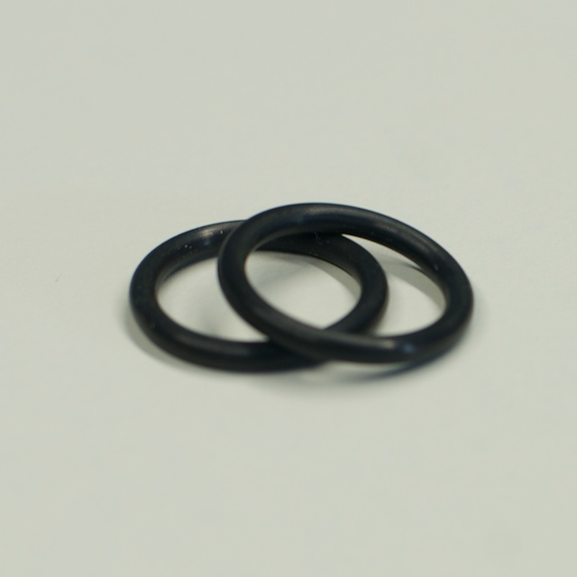
<td align="center">2</td>
<td align="center">0.10</td>
</tr>
<tr class="odd">
<td>X-OpenSPIM</td>
<td align="center" bgcolor="green">self made</td>
<td>milled <strong>acrylic sample chamber</strong> that holds two 10x Nikon water dipping illumination objectives (CFI Plan Fluor 10X W) and two 40x Nikon water dipping detection objectives (CFI Apochromat NIR 40X W) 
 
<em>plus four M5 screws</em></td>
<td><a href="documents/SampleChamber_X-OpenSPIM_Nikon10x40x.PDF">SampleChamber X-OpenSPIM Nikon10x40x.PDF</a></td>
<td align="center">
<td align="center">1</td>
<td align="center"></td>
</tr>
<tr class="even">
<td>X-OpenSPIM</td>
<td align="center" bgcolor="green">self made</td>
<td><strong>metal holder</strong> for the acrylic X-OpenSPIM sample chamber</td>
<td><a href="documents/SampleChamberHolder_X-OpenSPIM_Nikon10x40x.PDF">SampleChamberHolder X-OpenSPIM Nikon10x40x.PDF</a></td>
<td align="center">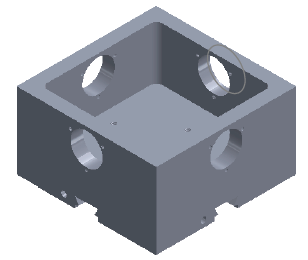
<td align="center">1</td>
<td align="center"></td>
</tr>
<tr class="odd">
<td>X-OpenSPIM</td>
<td align="center" bgcolor="green">self made</td>
<td>metal <strong>objective holder ring</strong> attaching the illumination and detection lens to the metal sample chamber holder (Note: co-focusing the two detection objectives requires one objective to be moved in z. One way of doing this is modifying one of the objetive holder rings with an additional stalk. Furthermore it is recommended to introduce a corner mirror to one detection axis; see <a href="documents/X-OpenSPIM_modifications.pdf">X-OpenSPIM_modifications.pdf</a>). 
 
<em>plus three M3 x 8 mm screws for each</em></td>
<td><a href="documents/ObjectiveHolderRing_X-OpenSPIM_Nikon10x40x.PDF">ObjectiveHolderRing X-OpenSPIM Nikon10x40x.PDF</a></td>
<td align="center"></td>
<td align="center">1</td>
<td align="center"></td>
</tr>
</table>

## Detection Axis Optical Components List

<table>
<tr class="header">
<th>Manufacturer</th>
<th>Accessibility</th>
<th>Description</th>
<th>File or Link/Model #</th>
<th>Image</th>
<th>Quantity</th>
<th>Price (EUR)</th>
</tr>
<tr class="odd">
<td>Olympus</td>
<td align="center" bgcolor="pink">purchase</td>
<td>Water dipping <b>objective lens for detection</b> (20x/0.5)</td>
<td><a href="https://www.olympus-lifescience.com/en/objectives/detail/0-DIRECTORY%3A%3ADirFrontend-itemId.511706539.html">UMPLFLN 20XW</a></td>
<td align="center">
<td align="center">1</td>
<td align="center">1650</td>
</tr>
<tr class="even">
<td>OpenSPIM</td>
<td align="center" bgcolor="green">self made</td>
<td>The <strong>detection axis holder</strong> holds everything behind the detection objective to the camera at the desired height of 50 mm off the surface of the optical breadboard. 
 
<em>plus two M5 x 50mm and two M6 x 25mm screws</em></td>
<td><a href="models/OpenSPIM_Detection-Axis-Holder_Base.STL">Base.stl</a> 
<a href="models/OpenSPIM_Detection-Axis-Holder_Base.STEP">Base.step</a> 
<a href="documents/OpenSPIM_Detection-Axis-Holder_Base.PDF">Base.pdf</a> 
 
<a href="models/OpenSPIM_Detection-Axis-Holder_Top.STL">Top.stl</a> 
<a href="models/OpenSPIM_Detection-Axis-Holder_Top.STEP">Top.step</a> 
<a href="documents/OpenSPIM_Detection-Axis-Holder_Top.PDF">Top.pdf</a></td>
<td align="center">
<td align="center">1</td>
<td align="center">50, <a href="mailto:wwwpfdecouk@gmail.com?&amp;Subject=Production%20of%20___%20detection%20axis%20holder%20top%20for%20the%20OpenSPIM%20system">Email vendor</a></td>
</tr>
<tr class="odd">
<td>OpenSPIM</td>
<td align="center" bgcolor="green">self made</td>
<td>The <strong>infinity space tube</strong> defines the distance between the detection objective and its tube lens. 
 
<em>plus three M2.5 x 6mm setscrews 120 degrees opposed to each other</em></td>
<td><a href="models/OpenSPIM_Infinity-Space.STL">infinity.stl</a> 
<a href="models/OpenSPIM_Infinity-Space.STEP">infinity.step</a> 
<a href="documents/OpenSPIM_Infinity-Space.PDF">infinity.pdf</a></td>
<td align="center">
<td align="center">1</td>
<td align="center">70, <a href="mailto:wwwpfdecouk@gmail.com?&amp;Subject=Production%20of%20___%20detection%20axis%20holder%20base%20for%20the%20OpenSPIM%20system">Email vendor</a></td>
</tr>
<tr class="even">
<td><a href="https://www.thorlabs.de/newgrouppage9.cfm?objectgroup_id=1001">ThorLabs</a> 
<a href="https://www.semrock.com/">Semrock</a> 
<a href="https://www.chroma.com/">Chroma</a> 
<a href="https://www.omegafilters.com/">Omega</a></td>
<td align="center" bgcolor="pink">purchase</td>
<td>Ø1"/25.4 mm <strong>Fluorescent Microscopy Filter</strong> 
 
Make sure to get at least one good bandpass (FWHM 30-50 nm) and a longpass that block the illumination well</td>
<td> </td>
<td align="center">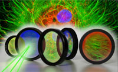
<td align="center"> </td>
<td align="center">100-300</td>
</tr>
<tr class="odd">
<td>OpenSPIM</td>
<td align="center" bgcolor="green">self made</td>
<td>Ø1"/Ø25.4 mm <strong>microscopy fluorescence emission filter holder</strong> that fits into OpenSPIM's infinity space 
 
Here are some companies who make Ø1" (Ø25.4 mm) microscopy filters: 
<a href="https://www.semrock.com/">Semrock</a>, <a href="https://www.chroma.com/">Chroma</a>, <a href="https://www.omegafilters.com/">Omega</a>, and even <a href="https://www.thorlabs.com/navigation.cfm?Guide_ID=21">ThorLabs</a>. 
 
<em>Note: the CAD files are showing fancier version compared to the pictures</em></td>
<td><a href="models/OpenSPIM_1in_Micro_Filter-Holder_Base.STL">Base.stl</a> 
<a href="models/OpenSPIM_1in_Micro_Filter-Holder_Base.STEP">Base.step</a> 
<a href="documents/OpenSPIM_1in_Micro_Filter-Holder_Base.PDF">Base.pdf</a> 
 
<a href="models/OpenSPIM_1in_Micro_Filter-Holder_Top.STL">Top.stl</a> 
<a href="models/OpenSPIM_1in_Micro_Filter-Holder_Top.STEP">Top.step</a> 
<a href="documents/OpenSPIM_1in_Micro_Filter-Holder_Top.PDF">Top.pdf</a></td>
<td align="center">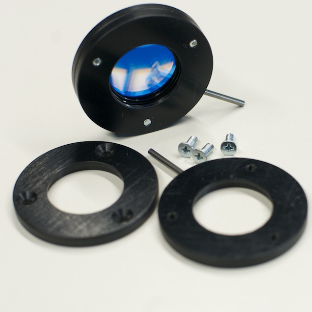
<td align="center">2</td>
<td align="center">50, <a href="mailto:wwwpfdecouk@gmail.com?&amp;Subject=Production%20of%20___%20microscopy%20fluorescent%20filter%20top%20for%20the%20OpenSPIM%20system">email vendor</a></td>
</tr>
<tr class="even">
<td>OpenSPIM</td>
<td align="center" bgcolor="green">self made</td>
<td>Ø1 1/4" (Ø31.5 mm) <strong>astronomy filter holder</strong> that fits into OpenSPIM's infinity space 
 
<em>Note: the CAD files are showing fancier version compared to the pictures</em></td>
<td><a href="models/OpenSPIM_1-25in_Astro_Filter-Holder_Base.STL">Base.stl</a> 
<a href="models/OpenSPIM_1-25in_Astro_Filter-Holder_Base.STEP">Base.step</a> 
<a href="documents/OpenSPIM_1-25in_Astro_Filter-Holder_Base.PDF">Base.pdf</a> 
 
<a href="models/OpenSPIM_1-25in_Astro_Filter-Holder_Top.STL">Top.stl</a> 
<a href="models/OpenSPIM_1-25in_Astro_Filter-Holder_Top.STEP">Top.step</a> 
<a href="documents/OpenSPIM_1-25in_Astro_Filter-Holder_Top.PDF">Top.pdf</a></td>
<td align="center">
<td align="center">2</td>
<td align="center">50, <a href="mailto:wwwpfdecouk@gmail.com?&amp;Subject=Production%20of%20___%20astronomy%20fluorescent%20filter%20top%20for%20the%20OpenSPIM%20system">email vendor</a></td>
</tr>
<tr class="odd">
<td>Olympus</td>
<td align="center" bgcolor="pink">purchase</td>
<td><strong>Tube lens</strong> for Olympus detection objective</td>
<td><a href="https://www.olympus-lifescience.com/en/oem-components/optical_module/">U-TLU</a></td>
<td align="center">
<td align="center">1</td>
<td align="center">750</td>
</tr>
<tr class="even">
<td>Thorlabs (for X-OpenSPIM)</td>
<td align="center" bgcolor="pink">purchase</td>
<td><strong>ITL200 Tube lens</strong> for Nikon 40x detection objective (CFI Apochromat NIR 40X W)</td>
<td><a href="documents/ITL200-AutoCADPDF.pdf">ITL200-AutoCADPDF.pdf</a></td>
<td align="center">
<td align="center">1</td>
<td align="center">438,35</td>
</tr>
<tr class="odd">
<td>X-OpenSPIM</td>
<td align="center" bgcolor="green">self made</td>
<td><strong>ITL200 tube lens adapter</strong> for Nikon 40x detection objective (CFI Apochromat NIR 40X W)</td>
<td><a html="Tube_Lens_adapter_for_Nikon.pdf">Tube_Lens_adapter_for_Nikon.pdf</a></td>
<td align="center">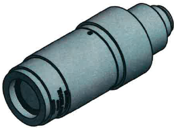
<td align="center">1</td>
<td align="center"></td>
</tr>
<tr class="even">
<td>Olympus</td>
<td align="center" bgcolor="pink">purchase</td>
<td>1x magnifying <strong>camera mount</strong></td>
<td><a href="https://www.olympus-lifescience.com">U-TV1 X &amp; U-CMAD3</a></td>
<td align="center">
<td align="center">1</td>
<td align="center">70 
140</td>
</tr>
<tr class="odd">
<td>Olympus</td>
<td align="center" bgcolor="pink">purchase</td>
<td>0.5x magnifying <strong>camera mount</strong></td>
<td><a href="https://www.olympus-lifescience.com">U-TV0.5XC-3</a></td>
<td align="center">
<td align="center">1</td>
<td align="center">425</td>
</tr>
</table>

## 4D Motor System Parts List

<table>
<tr class="header">
<th>Manufacturer</th>
<th>Accessibility</th>
<th>Description</th>
<th>File or Link/Model #</th>
<th>Image</th>
<th>Quantity</th>
<th>Price (EUR)</th>
</tr>
<tr class="odd">
<td><a href="http://picardindustries.com/products/multi-axis-motions/usb-4d-stage/">Picard-Industries</a></td>
<td align="center" bgcolor="pink">purchase</td>
<td>compact 4 axis motor assembly <strong>USB-4D-Stage</strong> from Picard-Industries 
 
<em>Includes 4 motors assembled on a base plate, sample positioning arm, 5 M3 screws to bolt the sample positioning arm onto the motor assembly</em></td>
<td>USB-4D-Stage</td>
<td align="center"></td>
<td align="center">1</td>
<td align="center">4260 USD, <a href="mailto:jdepatie@picard-industries.com&amp;Subject=Production%20of%20___%20USB%204D%20Motor%20system%20for%20the%20OpenSPIM%20system">email vendor"</a></td>
</tr>
<tr class="even">
<td>OpenSPIM</td>
<td align="center" bgcolor="green">self made</td>
<td><strong>pulley system</strong> to attach to sample holder arm and rotate the sample</td>
<td><a href="models/OpenSPIM_Sample_Pulley.STL">sample.stl</a> 
<a href="documents/OpenSPIM_Sample_Pulley.PDF">sample.pdf</a> 
 
<a href="models/OpenSPIM_Motor_Pully.STL">motor.stl</a> 
<a href="documents/OpenSPIM_Motor_Pully.PDF">motor.pdf</a></td>
<td align="center">
<td align="center">1 each</td>
<td align="center"> </td>
</tr>
<tr class="odd">
<td>any</td>
<td align="center" bgcolor="pink">purchase</td>
<td>O-ring or rubber band for the rotation pulley</td>
<td>any</td>
<td align="center">
<td align="center">1</td>
<td align="center"> </td>
</tr>
<tr class="even">
<td>OpenSPIM</td>
<td align="center" bgcolor="pink">purchase</td>
<td><strong>Ball bearing system</strong> for the front part of the sample rotation pulley system. 
 
<em>Note: shown inserted inside the sample positioning arm</em></td>
<td><a href="https://de.rs-online.com/web/p/kugellager/4090057/">NSK 6001Z</a></td>
<td align="center">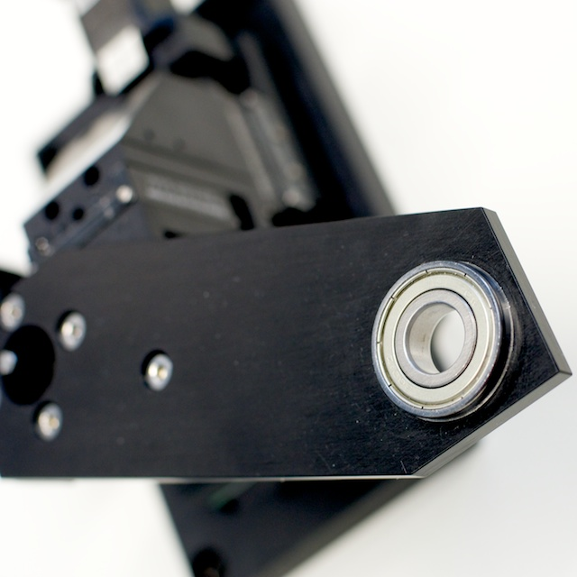
<td align="center">1</td>
<td align="center"> </td>
</tr>
<tr class="odd">
<td>ThorLabs</td>
<td align="center" bgcolor="pink">purchase</td>
<td><strong>Breadboard clamps</strong> to hold the positioned motor assembly onto the breadboard 
 
Variable Height Clamp, Metric, M6 Tapped</td>
<td><a href="https://www.thorlabs.com/thorproduct.cfm?partnumber=CL3/M">CL3/M 2"</a> 
 
<a href="https://www.thorlabs.com/thorproduct.cfm?partnumber=CL2/M">CL2/M 3"</a></td>
<td align="center">
<td align="center">2-3</td>
<td align="center">9</td>
</tr>
</table>

## Electronics

<table>
<tr class="header">
<th>Manufacturer</th>
<th>Accessibility</th>
<th>Description</th>
<th>File or Link/Model #</th>
<th>Image</th>
<th>Quantity</th>
<th>Price (EUR)</th>
</tr>
<tr class="odd">
<td>Apple</td>
<td align="center" bgcolor="pink">purchase</td>
<td>Laptop <strong>computer</strong> to operate the OpenSPIM system. We use Apple MacBook Pro with effectively 4GB of RAM and 256GB SSS hard drive running 32 bit Windows XP. 
 
<em>Note: We are forced to use Windows due to availability of drivers, and the MacBook Pro for it's firewire jack</em></td>
<td><a href="https://www.apple.com">Mac Book Pro</a></td>
<td align="center">
<td align="center">1</td>
<td align="center"> </td>
</tr>
<tr class="even">
<td>Andor/ 
Hamamatsu/ 
pco</td>
<td>purchase 
</td>
<td><strong>Digital camera</strong> 
 
 
 
Andor Zyla 
 
 
 
Hamamatsu ORCA-Flash4.0 LT 
 
pco.edge 4.2 sCMOS</td>
<td><a href="https://www.andor.com/scientific-cameras/neo-and-zyla-scmos-cameras">Andor Zyla 5.5 or 4.2</a> 
 
<a href="https://www.hamamatsu.com/eu/en/community/life_science_camera/product/search/C11440-42U/index.html">Hamamatsu ORCA-Flash4.0 LT</a> 
 
<a href="https://www.pco.de/scmos-cameras/pcoedge-42/">pco.edge 4.2</a></td>
<td align="center">
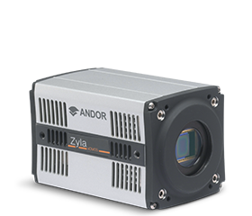 
 

</td>
<td align="center">1</td>
<td align="center">Ask for quote</td>
</tr>
<tr class="odd">
<td>Keyspan</td>
<td align="center" bgcolor="pink">purchase</td>
<td><strong>USB to serial adaptor</strong> for the laser</td>
<td><a href="https://www.tripplite.com/en/products/model.cfm?txtModelID=3914">TRIPP-LITE Model-USA-19HS</a></td>
<td align="center">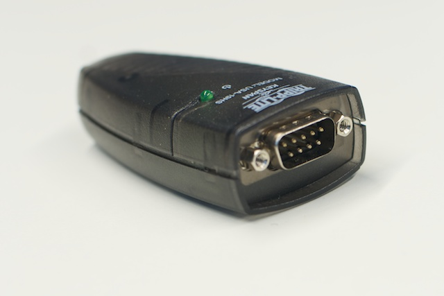</td>
<td align="center">1</td>
<td align="center">50</td>
</tr>
<tr class="even">
<td>any electronics vendor</td>
<td align="center" bgcolor="pink">purchase</td>
<td><strong>USB cables</strong> for the 4D positioning system and USB hub (at minimum 5 USB positions)</td>
<td> </td>
<td align="center">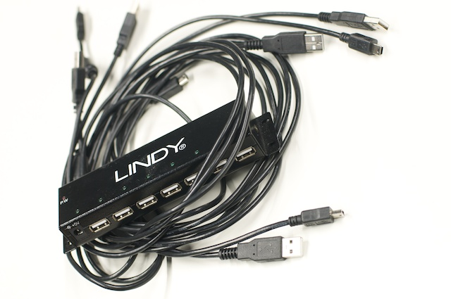</td>
<td align="center">4 &amp; 1</td>
<td align="center"> </td>
</tr>
<tr class="odd">
<td>any electronics vendor</td>
<td align="center" bgcolor="pink">purchase</td>
<td>USB led <strong>lamp</strong> for brightfield illumination of the sample during set-up</td>
<td><a href="https://www.conrad.de/ce/de/product/775534/USB-LED-LAMPE-SCHWANENHALS-MIT-1-LED/SHOP_AREA_40124&amp;promotionareaSearchDetail=005">Conrad electronics</a></td>
<td align="center">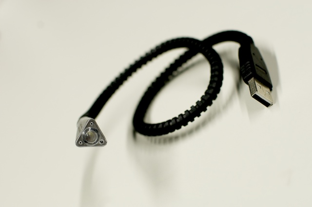</td>
<td align="center">1</td>
<td align="center">6</td>
</tr>
</table>

## Optional Parts List

<table>
<tr>
<tr class="header">
<th>Manufacturer</th>
<th>Accessibility</th>
<th>Description</th>
<th>File or Link/Model #</th>
<th>Image</th>
<th>Quantity</th>
<th>Price (EUR)</th>
</tr>
<tr class="odd">
<td>ThorLabs</td>
<td align="center" bgcolor="pink">purchase</td>
<td>M4 Cap Screw and Hardware Kit</td>
<td><a href="https://www.thorlabs.de/thorProduct.cfm?partNumber=HW-KIT1/M">HW-KIT1/M</a></td>
<td align="center"></td>
<td align="center">1</td>
<td align="center">50</td>
</tr>
<tr class="even">
<td>ThorLabs</td>
<td align="center" bgcolor="pink">purchase</td>
<td>M6 Cap Screw and Hardware Kit</td>
<td><a href="https://www.thorlabs.de/thorProduct.cfm?partNumber=HW-KIT2/M">HW-KIT2/M</a></td>
<td align="center">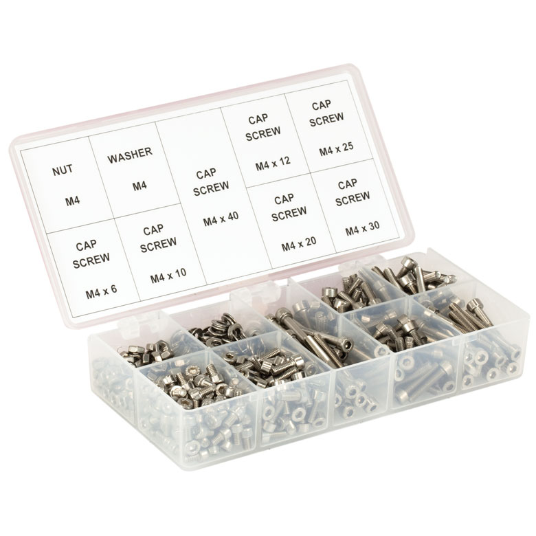</td>
<td align="center">1</td>
<td align="center">95</td>
</tr>
<tr class="odd">
<td>ThorLabs</td>
<td align="center" bgcolor="pink">
purchase 
 either one of them...
</td>
<td>SM1 Spanner Wrench</td>
<td>
<a href="https://www.thorlabs.de/thorProduct.cfm?partNumber=SPW602">SPW602</a> or <a href="https://www.thorlabs.de/thorProduct.cfm?partNumber=SPW606">SPW606</a></td>
<td align="center">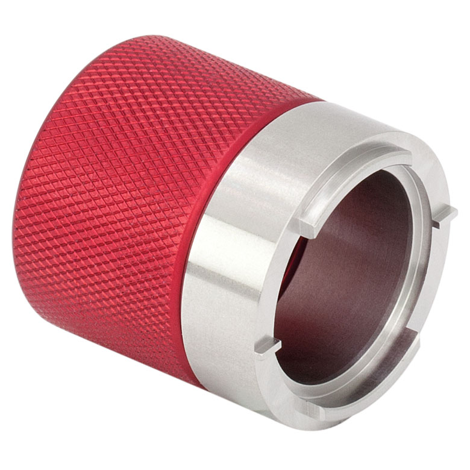</td>
<td align="center">1</td>
<td align="center">25</td>
</tr>
</table>

Once you have all the parts continue on to [step by step assembly](Step_by_step_assembly)
