 This site lists the additional parts required to assemble an X-OpenSPIM configuration (four-lens geometry) with dual sided illumination and dual sided detection as shown in the image below and is an upgrade from the original <a href=\Table_of_parts>L-OpenSPIM design</a>.

The described X-OpenSPIM system is equipped with two [Andor sCMOS Neo 5.5 camera](https://andor.oxinst.com/products/scmos-camera-series/neo-5-5-scmos), which together with the Hamamatsu Flash4 and PCO Edge cameras are known to work with µManager’s <a href="https://micro-manager.org/wiki/Utilities#Multi-Camera">Multi-Camera</a> function.

The two laser lines (488 and 561) come from a multiple wavelength laser system <a href=https://www.vortranlaser.com>Stradus VersaLase</a> and are under the control of an ArduinoUNO board (camera-laser synchronization).

Some self-made parts, including an X-OpenSPIM acquisition chamber, can be purchased from <a href="https://www.pfde.co.uk/p/698089/openspim-microscope-parts">Pieter Fourie Design and Engineering</a>.

<figure align="center">
  <a href="/images/µOpenSPIM/X-OpenSPIM.jpg" target="_blank" title="Click for a higher resolution image">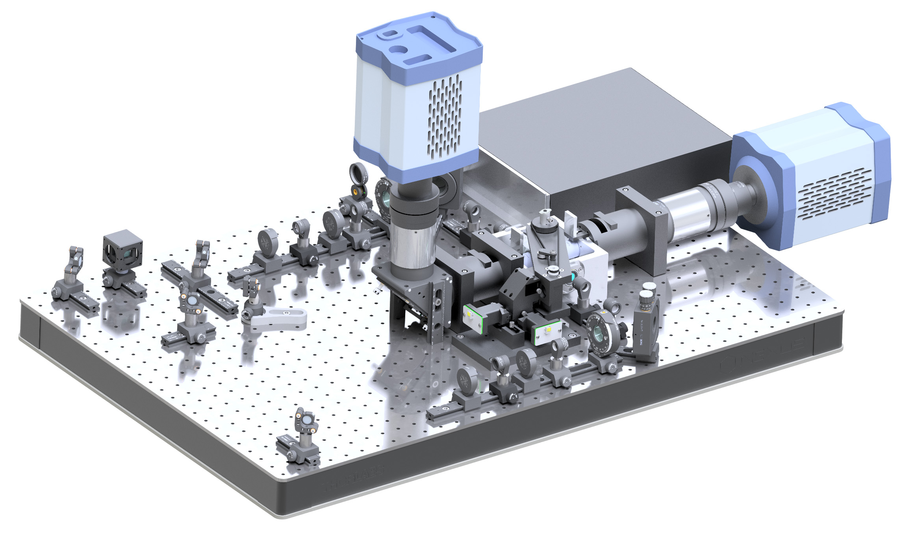</a>
<figcaption>Accurate rendering of the X-OpenSPIM currently in use in the Tomancak lab (side view). Image created with Autodesk Inventor by Charlène Brillard.

</figcaption>
</figure>  

## Upgrade from L-OpenSPIM to X-OpenSPIM

<table>
<tr class="header">
<th>Configuration</th>
<th>Accessibility</th>
<th>Description</th>
<th>File or Link/Model</th>
<th>Image</th>
<th>Quantity</th>
<th>Price</th>
</tr>

<tr class="odd">
<td align="center">&nbsp;&nbsp;&nbsp;X-OpenSPIM&nbsp;&nbsp;&nbsp;</td>
<td align="center" bgcolor="#98FB98">self made</td>
<td align="center">&nbsp;&nbsp;&nbsp;&nbsp;&nbsp;&nbsp;&nbsp;&nbsp;&nbsp;&nbsp;&nbsp;&nbsp;&nbsp;&nbsp;&nbsp;&nbsp;&nbsp;&nbsp;&nbsp;&nbsp;&nbsp;&nbsp;&nbsp;&nbsp;&nbsp;&nbsp;&nbsp;&nbsp;&nbsp;OpenSPIM with four-lens SPIM geometry&nbsp;&nbsp;&nbsp;&nbsp;&nbsp;&nbsp;&nbsp;&nbsp;&nbsp;&nbsp;&nbsp;&nbsp;&nbsp;&nbsp;&nbsp;&nbsp;&nbsp;&nbsp;&nbsp;&nbsp;&nbsp;&nbsp;&nbsp;&nbsp;&nbsp;&nbsp;&nbsp;&nbsp;&nbsp;</td>
<td align="center"> &nbsp;&nbsp;&nbsp;&nbsp;&nbsp;&nbsp;&nbsp;&nbsp;&nbsp;&nbsp;&nbsp;&nbsp;<a href="/images/µOpenSPIM/X-OpenSPIM.stp">X-OpenSPIM.stp</a>&nbsp;&nbsp;&nbsp;&nbsp;&nbsp;&nbsp;&nbsp;&nbsp;&nbsp;&nbsp;&nbsp;&nbsp; For a top view rendering with labelled parts click <a href="images/X-OpenSPIM_rendering_topview.jpg">here</a>.
</td>
<td align="center">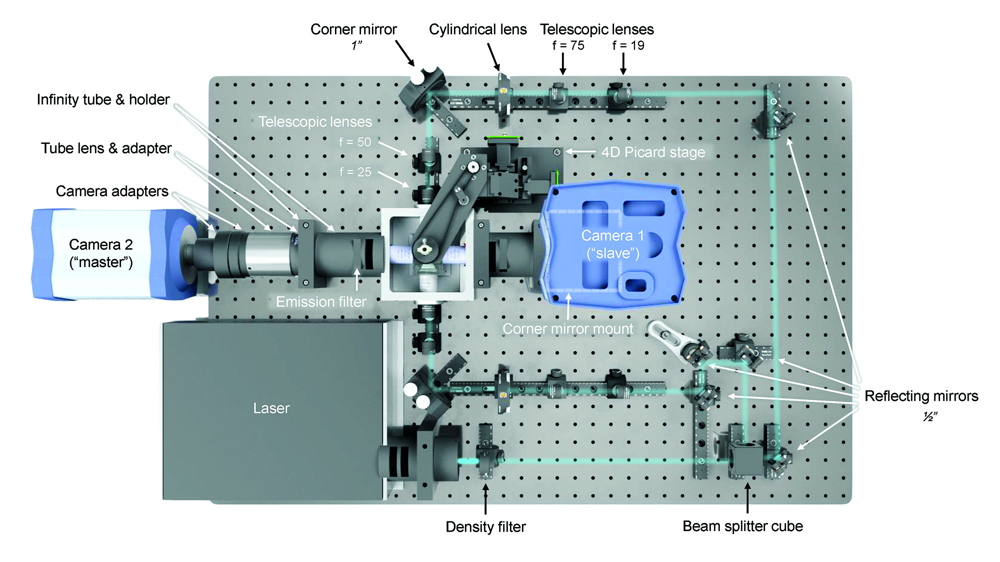</td>
<td align="center">1</td>
<td align="center">~13000 € (without cameras/ self made parts)</td>
</tr>

</table>

## Purchased and self made parts list for the X-OpenSPIM upgrade

<table>
<tr class="header">
<th>Manufacturer</th>
<th>Accessibility</th>
<th>Description</th>
<th>File or Link/Model</th>
<th>Image</th>
<th>Quantity</th>
<th>Price</th>
</tr>

<tr class="odd">
<td align="center">Arduino</td>
<td align="center" bgcolor="#87CEFA">purchase</td>
<td align="center">Arduino UNO Rev3 SMD</td>
<td align="center"> <a href="https://store.arduino.cc/arduino-uno-rev3-smd">A000073</a></td>
<td align="center"></td>
<td align="center">1</td>
<td align="center">19 €</td>
</tr>

<tr class="even">
<td align="center">Nikon</td>
<td align="center" bgcolor="#87CEFA">purchase</td>
<td align="center">CFI Plan Fluor 10x W/ 0.30/ 3,50  10x water-dipping objective, N.A. 0.10</td>
<td align="center"> <a href="https://www.microscope.healthcare.nikon.com/en_EU/products/optics/cfi60-water-dipping-series">CFI Plan Fluor 10X W</a> <a href="https://www.thorlabs.com/thorproduct.cfm?partnumber=N10XW-PF">CFI Plan Fluor 10X W (Thorlabs)</a></td>
<td align="center">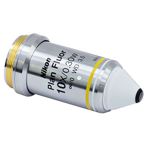</td>
<td align="center">2</td>
<td align="center">~1500 € (Thorlabs)</td>
</tr>

<tr class="odd">
<td align="center">Nikon</td>
<td align="center" bgcolor="#87CEFA">purchase</td>
<td align="center">CFI Apochromat 40x W NIR/ 0.80/ 3,50 40x water-dipping objective, N.A 0.80)</td>
<td align="center"><a href="https://www.microscope.healthcare.nikon.com/en_EU/products/optics/cfi60-water-dipping-series">CFI Apochromat NIR 40X W</a> <a href="https://www.microscope.healthcare.nikon.com/en_EU/products/optics/cfi60-water-dipping-series">CFI Apochromat NIR 40X W (Thorlabs)</a></td>
<td align="center">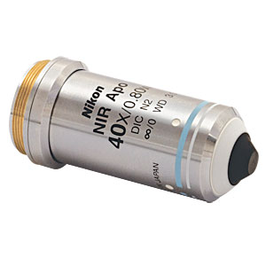</td>
<td align="center">2</td>
<td align="center">~2850 € (Thorlabs)</td>
</tr>

<tr class="even">
<td align="center">PFDE</td>
<td align="center" bgcolor="#87CEFA">purchase</td>
<td align="center">Detection axis holder, base</td>
<td align="center"> <a href="https://www.pfde.co.uk/p/698089/openspim-microscope-parts/">Part 9</a></td>
<td align="center">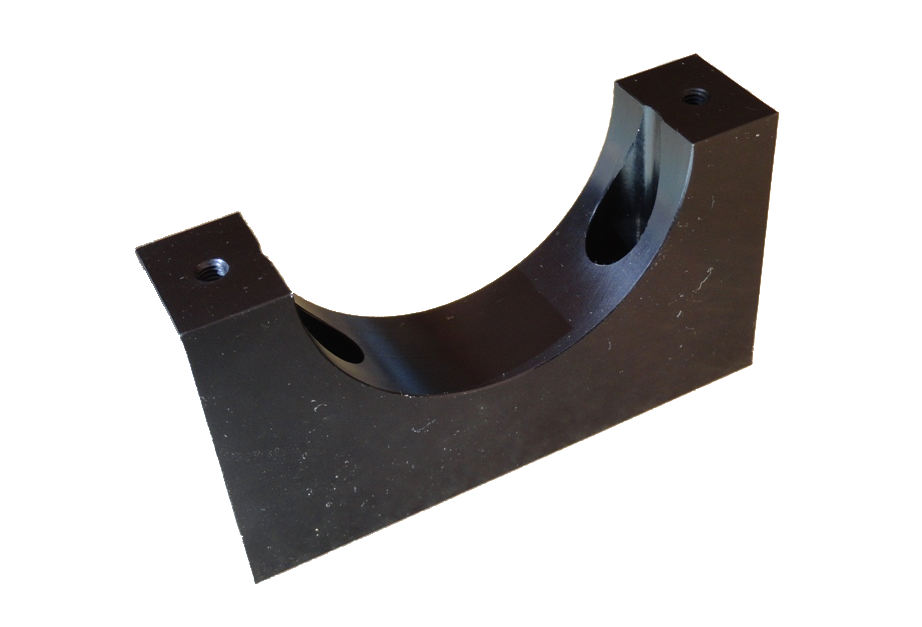</td>
<td align="center">2</td>
<td align="center">30 $</td>
</tr>

<tr class="odd">
<td align="center">PFDE</td>
<td align="center" bgcolor="#87CEFA">purchase</td>
<td align="center">Detection axis holder, top</td>
<td align="center"> <a href="https://www.pfde.co.uk/p/698089/openspim-microscope-parts">Part 10</a></td>
<td align="center"></td>
<td align="center">2</td>
<td align="center">30 $</td>
</tr>

<tr class="even">
<td align="center">Picard Industries</td>
<td align="center" bgcolor="#87CEFA">purchase</td>
<td align="center">USB-4D-STAGE R-Axis Upgrade kit</td>
<td align="center"> <a href="http://picardindustries.com/products/multi-axis-motions/usb-4d-stage/">N/A</a></td>
<td align="center">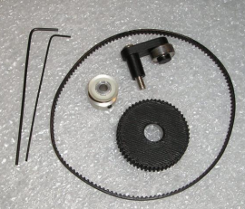</td>
<td align="center">1</td>
<td align="center">185 $</td>
</tr>

<tr class="odd">
<td align="center">Thorlabs</td>
<td align="center" bgcolor="#87CEFA">purchase</td>
<td align="center">Achromatic Doublet, f=19 mm, Ø1/2", SM05-Threaded Mount, ARC: 400-700 nm</td>
<td align="center"> <a href="https://www.thorlabs.com/thorproduct.cfm?partnumber=AC127-019-A-ML">AC127-019-A-ML</a></td>
<td align="center">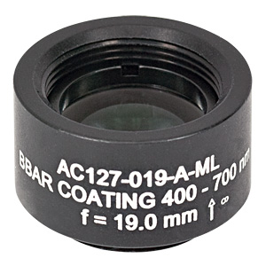</td>
<td align="center">2</td>
<td align="center">77,46 €</td>
</tr>

<tr class="even">
<td align="center">Thorlabs</td>
<td align="center" bgcolor="#87CEFA">purchase</td>
<td align="center">Achromatic Doublet, f=75 mm, Ø1/2", SM05-Threaded Mount, ARC: 400-700 nm</td>
<td align="center"> <a href="https://www.thorlabs.com/thorproduct.cfm?partnumber=AC127-075-A-ML">AC127-075-A-ML</a></td>
<td align="center"></td>
<td align="center">2</td>
<td align="center">77,46 €</td>
</tr>

<tr class="odd">
<td align="center">Thorlabs</td>
<td align="center" bgcolor="#87CEFA">purchase</td>
<td align="center">Adapter for Tube Lens with External SM2 Threads and Internal M38 x 0.5 Threads</td>
<td align="center"> <a href="https://www.thorlabs.com/thorproduct.cfm?partnumber=LMR1AP">SM2A20</a></td>
<td align="center">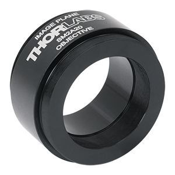</td>
<td align="center">2</td>
<td align="center">45,81 €</td>
</tr>

<tr class="even">
<td align="center">Thorlabs</td>
<td align="center" bgcolor="#87CEFA">purchase</td>
<td align="center">Alignment Plate for Ø1" Fixed Lens Mounts</td>
<td align="center"> <a href="https://www.thorlabs.com/thorproduct.cfm?partnumber=LMR1AP">LMR1AP</a></td>
<td align="center">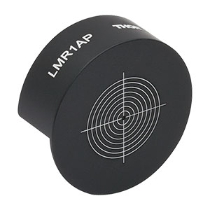</td>
<td align="center">2</td>
<td align="center">23,21 €</td>
</tr>

<tr class="odd">
<td align="center">Thorlabs</td>
<td align="center" bgcolor="#87CEFA">purchase</td>
<td align="center">Beamsplitter Cube 50:50</td>
<td align="center"> <a href="https://www.thorlabs.com/thorproduct.cfm?partnumber=BS004">BS004</a></td>
<td align="center">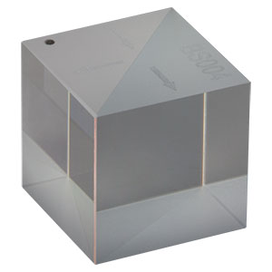</td>
<td align="center">1</td>
<td align="center">162,30 €</td>
</tr>

<tr class="even">
<td align="center">Thorlabs</td>
<td align="center" bgcolor="#87CEFA">purchase</td>
<td align="center">Beamsplitter Cube Adapter for Compact 30 mm Cage Cube</td>
<td align="center"> <a href="https://www.thorlabs.com/thorproduct.cfm?partnumber=BS127CAM">BS127CAM</a></td>
<td align="center"></td>
<td align="center">1</td>
<td align="center">39,84 €</td>
</tr>

<tr class="odd">
<td align="center">Thorlabs</td>
<td align="center" bgcolor="#87CEFA">purchase</td>
<td align="center">Broadband Dielectric Elliptical Mirror</td>
<td align="center"> <a href="https://www.thorlabs.com/thorproduct.cfm?partnumber=BBE2-E02">BBE2-E02</a></td>
<td align="center">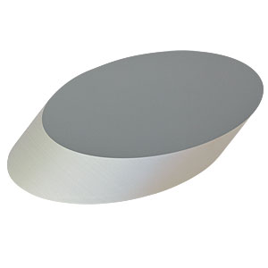</td>
<td align="center">1</td>
<td align="center">180,49 €</td>
</tr>

<tr class="even">
<td align="center">Thorlabs</td>
<td align="center" bgcolor="#87CEFA">purchase</td>
<td align="center">Broadband Dielectric Mirror, Ø1", 400 - 750 nm</td>
<td align="center"> <a href="https://www.thorlabs.com/thorproduct.cfm?partnumber=BB1-E02">BB1-E02</a></td>
<td align="center">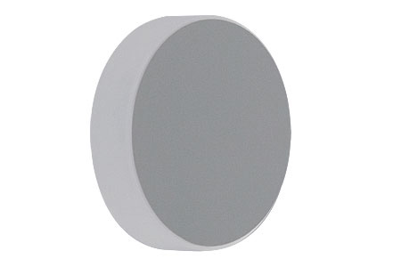</td>
<td align="center">2</td>
<td align="center">70,31 €</td>
</tr>

<tr class="odd">
<td align="center">Thorlabs</td>
<td align="center" bgcolor="#87CEFA">purchase</td>
<td align="center">Broadband Dielectric Mirror, Ø1/2", 400-750 nm</td>
<td align="center"> <a href="https://www.thorlabs.com/thorproduct.cfm?partnumber=BB05-E02">BB05-E02</a></td>
<td align="center">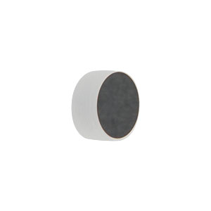</td>
<td align="center">5</td>
<td align="center">48,23 €</td>
</tr>

<tr class="even">
<td align="center">Thorlabs</td>
<td align="center" bgcolor="#87CEFA">purchase</td>
<td align="center">Clamping Fork, 1.24" Counterbored Slot, Universal</td>
<td align="center"> <a href="https://www.thorlabs.de/thorproduct.cfm?partnumber=CF125#ad-image-0">CF125</a></td>
<td align="center">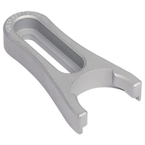</td>
<td align="center">2</td>
<td align="center">8,38 €</td>
</tr>

<tr class="odd">
<td align="center">Thorlabs</td>
<td align="center" bgcolor="#87CEFA">purchase</td>
<td align="center">Cylindrical Achromat Lens</td>
<td align="center"> <a href="https://www.thorlabs.de/thorproduct.cfm?partnumber=ACY254-050-A">ACY254-050-A</a></td>
<td align="center">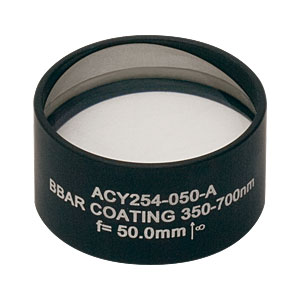</td>
<td align="center">1</td>
<td align="center">369,85 €</td>
</tr>

<tr class="even">
<td align="center">Thorlabs</td>
<td align="center" bgcolor="#87CEFA">purchase</td>
<td align="center">Dovetail Optical Rail, 300 mm, Metric</td>
<td align="center"> <a href="https://www.thorlabs.de/thorproduct.cfm?partnumber=RLA300/M">RLA300/M</a></td>
<td align="center">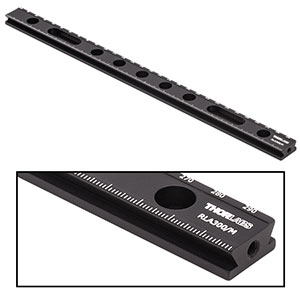</td>
<td align="center">2</td>
<td align="center">73,54 €</td>
</tr>

<tr class="odd">
<td align="center">Thorlabs</td>
<td align="center" bgcolor="#87CEFA">purchase</td>
<td align="center">Gimbal Mirror Mount, Ø25.4 mm</td>
<td align="center"> <a href="https://www.thorlabs.de/thorproduct.cfm?partnumber=GM100/M#ad-image-0">GM100/M</a></td>
<td align="center">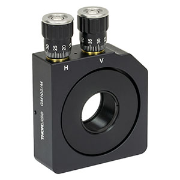</td>
<td align="center">1</td>
<td align="center">234,10 €</td>
</tr>

<tr class="even">
<td align="center">Thorlabs</td>
<td align="center" bgcolor="#87CEFA">purchase</td>
<td align="center">ITL200 Tube lens for Nikon</td>
<td align="center"> <a href="https://www.thorlabs.de/thorproduct.cfm?partnumber=ITL200">ITL200</a></td>
<td align="center">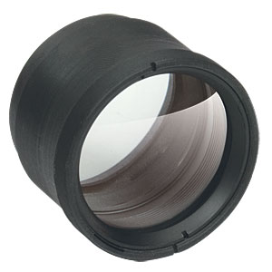</td>
<td align="center">2</td>
<td align="center">451,50 €</td>
</tr>

<tr class="odd">
<td align="center">Thorlabs</td>
<td align="center" bgcolor="#87CEFA">purchase</td>
<td align="center">Kinematic Mount for Ø12.7 mm Optics, Metric</td>
<td align="center"> <a href="https://www.thorlabs.de/thorproduct.cfm?partnumber=KM05/M#ad-image-0">KM05/M</a></td>
<td align="center">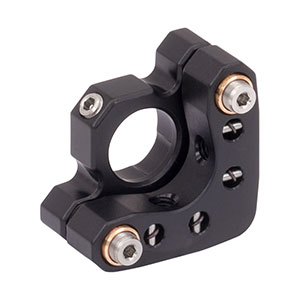</td>
<td align="center">5</td>
<td align="center">36,51 €</td>
</tr>

<tr class="even">
<td align="center">Thorlabs</td>
<td align="center" bgcolor="#87CEFA">purchase</td>
<td align="center">Lens Mount for Ø1/2" Optics, One Retaining Ring Included, M4 Tap</td>
<td align="center"> <a href="https://www.thorlabs.de/thorproduct.cfm?partnumber=ITL200">LMR05/M</a></td>
<td align="center">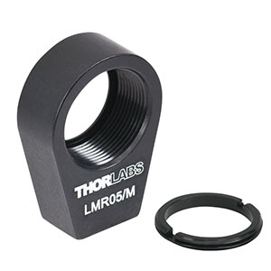</td>
<td align="center">2</td>
<td align="center">14,71 €</td>
</tr>

<tr class="odd">
<td align="center">Thorlabs</td>
<td align="center" bgcolor="#87CEFA">purchase</td>
<td align="center">Lens Mount with Retaining Ring for Ø1" Optics, M4 Tap</td>
<td align="center"> <a href="https://www.thorlabs.de/thorproduct.cfm?partnumber=ITL200">LMR1/M</a></td>
<td align="center">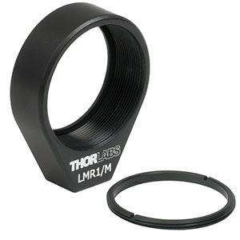</td>
<td align="center">2</td>
<td align="center">14,26 €</td>
</tr>

<tr class="even">
<td align="center">Thorlabs</td>
<td align="center" bgcolor="#87CEFA">purchase</td>
<td align="center">Mirror 30 mm Cage Cube, M4 Tap</td>
<td align="center"> <a href="https://www.thorlabs.de/thorproduct.cfm?partnumber=CCM1-4ER/M#ad-image-0">CCM1-4ER/M</a></td>
<td align="center">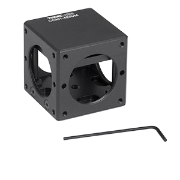</td>
<td align="center">1</td>
<td align="center">128,86 €</td>
</tr>

<tr class="odd">
<td align="center">Thorlabs</td>
<td align="center" bgcolor="#87CEFA">purchase</td>
<td align="center">Pedestal Post Holder</td>
<td align="center"> <a href="https://www.thorlabs.de/thorproduct.cfm?partnumber=PH20E/M#ad-image-0">PH20E/M</a></td>
<td align="center">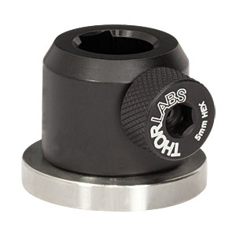</td>
<td align="center">2</td>
<td align="center">22,62 €</td>
</tr>

<tr class="even">
<td align="center">Thorlabs</td>
<td align="center" bgcolor="#87CEFA">purchase</td>
<td align="center">Rotation Mount for Ø1" Optics</td>
<td align="center"> <a href="https://www.thorlabs.de/thorproduct.cfm?partnumber=RSP1X15/M#ad-image-0">RSP1X15/M</a></td>
<td align="center">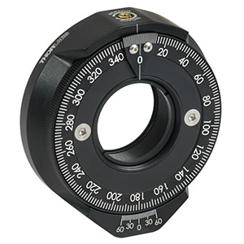</td>
<td align="center">1</td>
<td align="center">128,86 €</td>
</tr>

<tr class="odd">
<td align="center">Thorlabs</td>
<td align="center" bgcolor="#87CEFA">purchase</td>
<td align="center">Right-Angle Kinematic Elliptical Mirror Mount</td>
<td align="center"> <a href="https://www.thorlabs.de/thorproduct.cfm?partnumber=KCB2EC/M">KCB2EC/M</a></td>
<td align="center">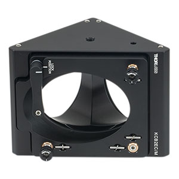</td>
<td align="center">1</td>
<td align="center">221,81 €</td>
</tr>

<tr class="even">
<td align="center">Thorlabs</td>
<td align="center" bgcolor="#87CEFA">purchase</td>
<td align="center">Vacuum-Compatible Optical Post, Ø12.7 mm, M4 Setscrew, M6 Tap, L = 20 mm</td>
<td align="center"> <a href="https://www.thorlabs.de/thorproduct.cfm?partnumber=TR20V/M">TR20V/M</a></td>
<td align="center">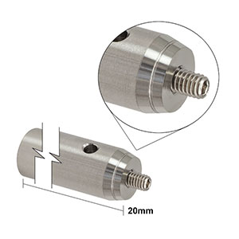</td>
<td align="center">2</td>
<td align="center">9,78 €</td>
</tr>

<tr class="odd">
<td align="center">OpenSPIM</td>
<td align="center" bgcolor="#98FB98">self made</td>
<td align="center">4D-Stage sample arm holder</td>
<td>
<a href="images/µOpenSPIM/4D-PicardStage/SampleArmHolder/4D-Motor-Arm_28mm.stl">&nbsp;4D-Motor-Arm_28mm.stl</a> 
<a href="images/µOpenSPIM/4D-PicardStage/SampleArmHolder/4D-Motor-Arm_28mm.stp">&nbsp;4D-Motor-Arm_28mm.stp</a> 
<a href="images/µOpenSPIM/4D-PicardStage/SampleArmHolder/4D-Motor-Arm_28mm.pdf">&nbsp;4D-Motor-Arm_28mm.pdf</a>
</td>
<td align="center">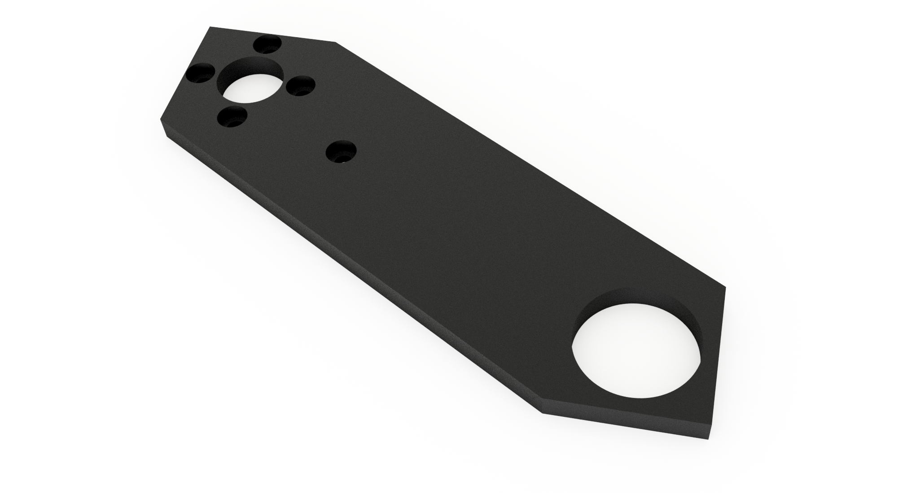</td>
<td align="center">1</td>
</tr>

<tr class="even">
<td align="center">OpenSPIM</td>
<td align="center" bgcolor="#98FB98">self made</td>
<td align="center">4D-Stage syringe holder</td>
<td>
<a href="images/µOpenSPIM/4D-PicardStage/SyringeHolder/SyringeHolder.stl">&nbsp;4D-Stage_syringe_holder.stl</a> 
<a href="images/µOpenSPIM/4D-PicardStage/SyringeHolder/SyringeHolder.stp">&nbsp;4D-Stage_syringe_holder.stp</a> 
<a href="images/µOpenSPIM/4D-PicardStage/SyringeHolder/SyringeHolder.pdf">&nbsp;4D-Stage_syringe_holder.pdf</a>
</td>
<td align="center">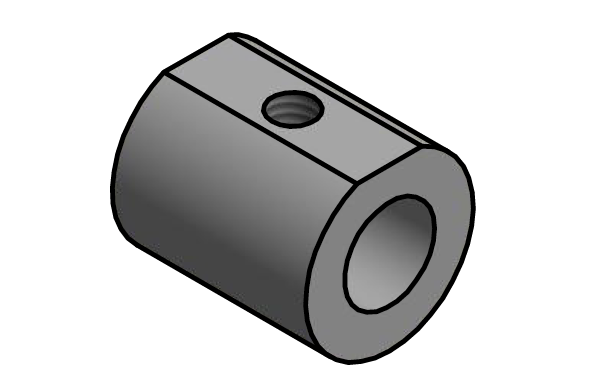</td>
<td align="center">1</td>
</tr>

<tr class="odd">
<td align="center">OpenSPIM</td>
<td align="center" bgcolor="#98FB98">self made</td>
<td align="center">Acrylic acquisition chamber</td>
<td>
<a href="images/µOpenSPIM/SampleChamber/SampleChamber.stl">&nbsp;SampleChamber.stl</a> 
<a href="images/µOpenSPIM/SampleChamber/SampleChamber.stp">&nbsp;SampleChamber.stp</a> 
<a href="images/µOpenSPIM/SampleChamber/SampleChamber.pdf">&nbsp;SampleChamber.pdf</a>
</td>
<td align="center">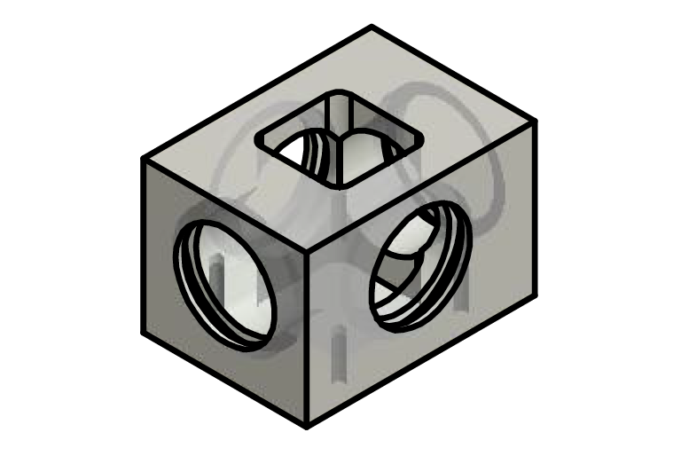</td>
<td align="center">1</td>
</tr>

<tr class="even">
<td align="center">OpenSPIM</td>
<td align="center" bgcolor="#98FB98">self made</td>
<td align="center">Dovetail Optical Rail, 300 mm, Metric (cut)</td>
<td>
<a href="images/µOpenSPIM/RLA300_M-Step_cut45/RLA300_M-Step_cut45.stp">&nbsp;RLA300_M-Step_cut45.stp</a>
</td>
<td align="center">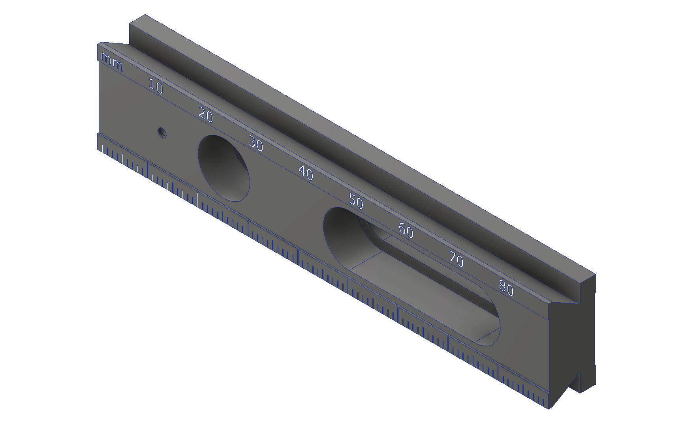</td>
<td align="center">2</td>
<td align="center"></td>
</tr>

<tr class="odd">
<td align="center">OpenSPIM</td>
<td align="center" bgcolor="#98FB98">self made</td>
<td align="center">Metal holder for acrylic acquisition chamber</td>
<td>
<a href="images/µOpenSPIM/SampleChamberHolder/SampleChamberHolder.stl">&nbsp;SampleChamberHolder.stl</a> 
<a href="images/µOpenSPIM/SampleChamberHolder/SampleChamberHolder.stp">&nbsp;SampleChamberHolder.stp</a> 
<a href="images/µOpenSPIM/SampleChamberHolder/SampleChamberHolder.pdf">&nbsp;SampleChamberHolder.pdf</a>
</td>
<td align="center">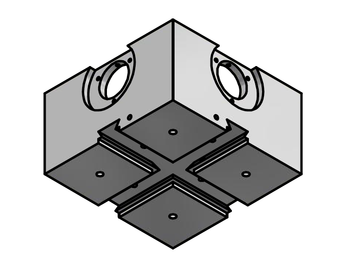</td>
<td align="center">1</td>
</tr>

<tr class="even">
<td align="center">OpenSPIM</td>
<td align="center" bgcolor="#98FB98">self made</td>
<td align="center">Metal holder bottom for acrylic acquisition chamber</td>
<td>
<a href="images/µOpenSPIM/SampleChamberHolderBottom/SampleChamberHolderBottom.stl">&nbsp;SampleChamberHolderBottom.stl</a> 
<a href="images/µOpenSPIM/SampleChamberHolderBottom/SampleChamberHolderBottom.stp">&nbsp;SampleChamberHolderBottom.stp</a> 
<a href="images/µOpenSPIM/SampleChamberHolderBottom/SampleChamberHolderBottom.pdf">&nbsp;SampleChamberHolderBottom.pdf</a>
</td>
<td align="center">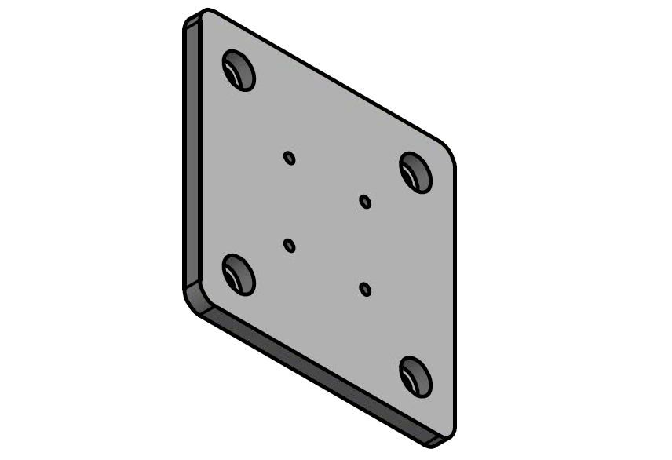</td>
<td align="center">1</td>
</tr>

<tr class="odd">
<td align="center">OpenSPIM</td>
<td align="center" bgcolor="#98FB98">self made</td>
<td align="center">Modified objective holder ring (part 1) Click <a href="/images/µOpenSPIM/ObjectiveHolder_assy/ObjectiveHolder-TailAssy.png">here</a> to view a rendering of the assembled objective holder ring (part 1-3. </td>
<td>
<a href="images/µOpenSPIM/ObjectiveHolder_ring/ObjectiveHolder_Ring.stl">&nbsp;ObjectiveHolder_Ring.stl</a> 
<a href="images/µOpenSPIM/ObjectiveHolder_ring/ObjectiveHolder_Ring.stp">&nbsp;ObjectiveHolder_Ring.stp</a> 
<a href="images/µOpenSPIM/ObjectiveHolder_ring/ObjectiveHolder_Ring.pdf">&nbsp;ObjectiveHolder_Ring.pdf</a>
</td>
<td align="center">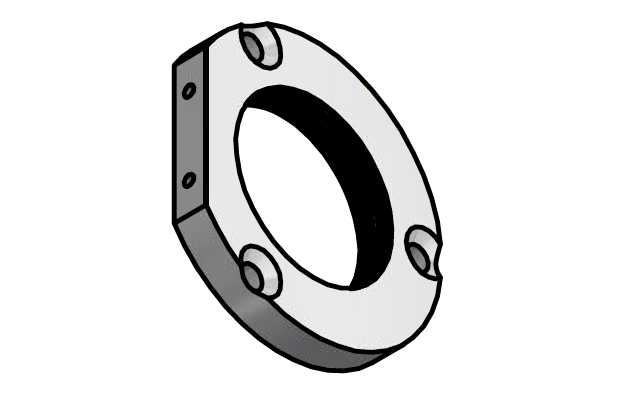</td>
<td align="center">4</td>
</tr>

<tr class="even">
<td align="center">OpenSPIM</td>
<td align="center" bgcolor="#98FB98">self made</td>
<td align="center">Modified objective holder ring (part 2) tail part one, which can be fixed to the acquisition chamber holder </td>
<td>
<a href="images/µOpenSPIM/ObjectiveHolder_tail1/ObjectiveHolder-Tail1.stl">&nbsp;ObjectiveHolder-Tail1.stl</a> 
<a href="images/µOpenSPIM/ObjectiveHolder_tail1/ObjectiveHolder-Tail1.stp">&nbsp;ObjectiveHolder-Tail1.stp</a> 
<a href="images/µOpenSPIM/ObjectiveHolder_tail1/ObjectiveHolder-Tail1.pdf">&nbsp;ObjectiveHolder-Tail1.pdf</a>
</td>
<td align="center">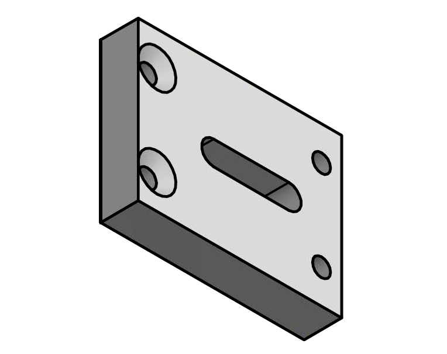</td>
<td align="center">4</td>
</tr>

<tr class="odd">
<td align="center">OpenSPIM</td>
<td align="center" bgcolor="#98FB98">self made</td>
<td align="center">Handle for objective holder ring (part 3)</td>
<td>
<a href="images/µOpenSPIM/ObjectiveHolder-tail2/ObjectiveHolder-Tail2.stl">&nbsp;ObjectiveHolder-Tail2.stl</a> 
<a href="images/µOpenSPIM/ObjectiveHolder-tail2/ObjectiveHolder-Tail2.stp">&nbsp;ObjectiveHolder-Tail2.stp</a> 
<a href="images/µOpenSPIM/ObjectiveHolder-tail2/ObjectiveHolder-Tail2.pdf">&nbsp;ObjectiveHolder-Tail2.pdf</a>
</td>
<td align="center">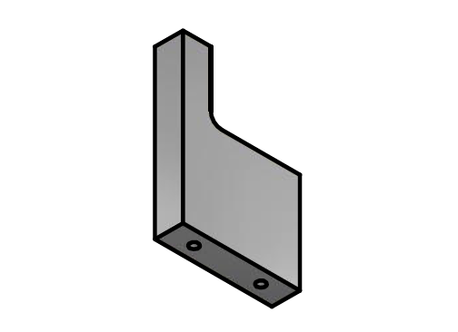</td>
<td align="center">4</td>
</tr>

<tr class="odd">
<td align="center">OpenSPIM</td>
<td align="center" bgcolor="#98FB98">self made</td>
<td align="center">Infinity space tube</td>
<td>
<a href="images/µOpenSPIM/InfinitySpaceTube/OpenSPIM_Infinity-Space.stl">&nbsp;OpenSPIM_Infinity-Space.stl</a> 
<a href="images/µOpenSPIM/InfinitySpaceTube/OpenSPIM_Infinity-Space.stp">&nbsp;OpenSPIM_Infinity-Space.stp</a> 
<a href="images/µOpenSPIM/InfinitySpaceTube/OpenSPIM_Infinity-Space.pdf">&nbsp;OpenSPIM_Infinity-Space.pdf</a>
</td>
<td align="center">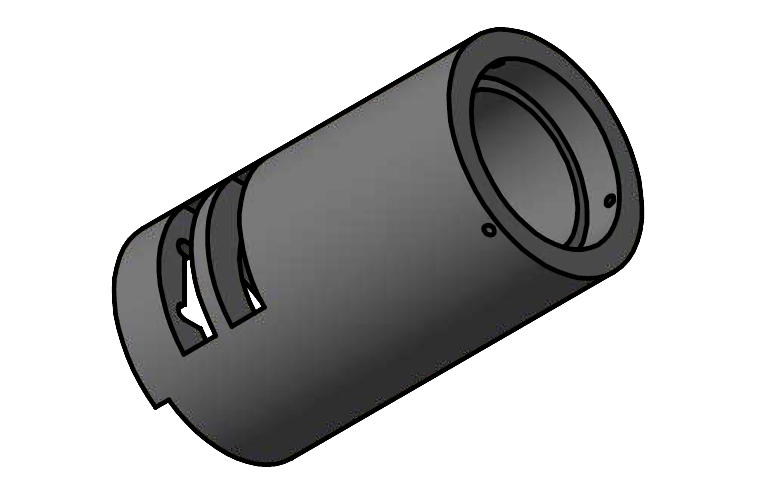</td>
<td align="center">2</td>
</tr>

<tr class="even">
<td align="center">OpenSPIM</td>
<td align="center" bgcolor="#98FB98">self made</td>
<td align="center">RC1 Ø1/2" lens stilt</td>
<td>
<a href="models/OpenSPIM_Stilt_1-2in-Lens.STL">&nbsp;RC1 Ø1/2" lens stilt.stl</a> 
<a href="models/OpenSPIM_Stilt_1-2in-Lens.STEP">&nbsp;RC1 Ø1/2" lens stilt.step</a> 
<a href="documents/OpenSPIM_Stilt_1-2in-Lens.PDF">&nbsp;RC1 Ø1/2" lens stilt.pdf</a>
</td>
<td align="center"></td>
<td align="center">4</td>
</tr>

<tr class="odd">
<td align="center">OpenSPIM</td>
<td align="center" bgcolor="#98FB98">self made</td>
<td align="center">Tube lens adapter to fit new Tube Lens (ITL200), f = 200 mm</td>
<td>
<a href="images/µOpenSPIM/CameraAdapter/TubeLensAdapter.stl">&nbsp;TubeLensAdapter.stl</a> 
<a href="images/µOpenSPIM/CameraAdapter/TubeLensAdapter.pdf">&nbsp;OpenSPIM_Infinity-Space.pdf</a>
</td>
<td align="center">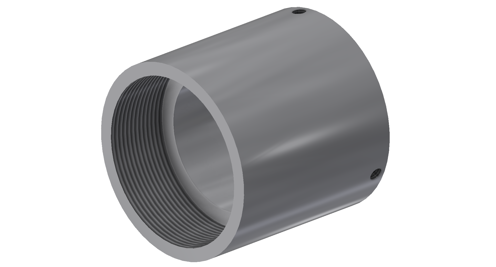</td>
<td align="center">2</td>
</tr>

</table>

Once you have all the parts continue on to [step by step assembly](\Table_of_parts_X-OpenSPIM)
