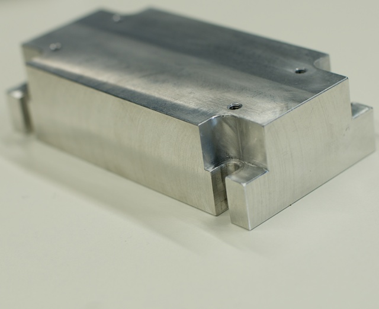

 This is a table of parts to get from an original L-OpenSPIM design to an X-OpenSPIM with dual sided illumination and dual sided detection 

(Pieter Fourie Design and Engineering has made parts for multiple OpenSPIM systems including an X-OpenSPIM acquisition chamber, a link to write an email is beside all self made parts in the list below in the price column)

## Illumination Parts List

<table>
<tr class="header">
<th>Manufacturer</th>
<th>Accessibility</th>
<th>Description</th>
<th>File or Link/Model</th>
<th>Image</th>
<th>Quantity</th>
<th>Price (EUR)</th>
</tr>

<tr class="odd">

<td align="center">Nikon</td>

<td align="center" bgcolor="#87CEFA">purchase</td>

<td> &nbsp;Whichever wavelength is <strong>necessary</strong> for your experiments.</td>

<td> <a href="http://www.vortranlaser.com/">&nbsp;VersaLase</a></td>

<td align="center"></td>

<td align="center">1</td>

<td align="center">200</td>

</tr>

<tr class="even">

<td align="center">OpenSPIM</td>

<td align="center" bgcolor="#98FB98">self made</td>
<td> &nbsp;The <strong>heat sink</strong> brings the laser...</td>

<td>
<a href="models/OpenSPIM_Cube-Laser_Heatsink.STL">&nbsp;Heatsink.stl</a> 
<a href="models/OpenSPIM_Cube-Laser_Heatsink.STEP">&nbsp;Heatsink.step</a> 
<a href="documents/OpenSPIM_Cube-Laser_Heatsink.PDF">&nbsp;Heatsink.pdf</a>
</td>

<td align="center"></td>

<td align="center">1</td>

<td align="center">70, <a href="mailto:wwwpfdecouk@gmail.com?Subject=Production%20of%20___%20laser%20heatsink%20for%20the%20OpenSPIM%20system">email vendo </a></td>

</tr>

</table>

## Opto-mechanical parts list

</table>

Once you have all the parts continue on to [step by step assembly](Step_by_step_assembly)
