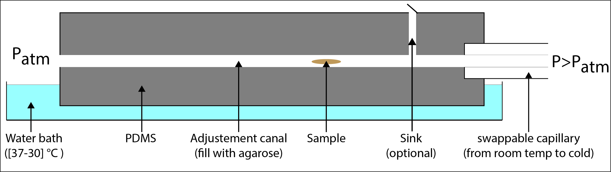
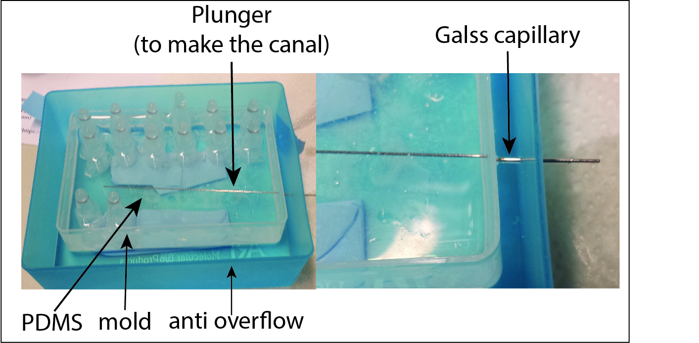
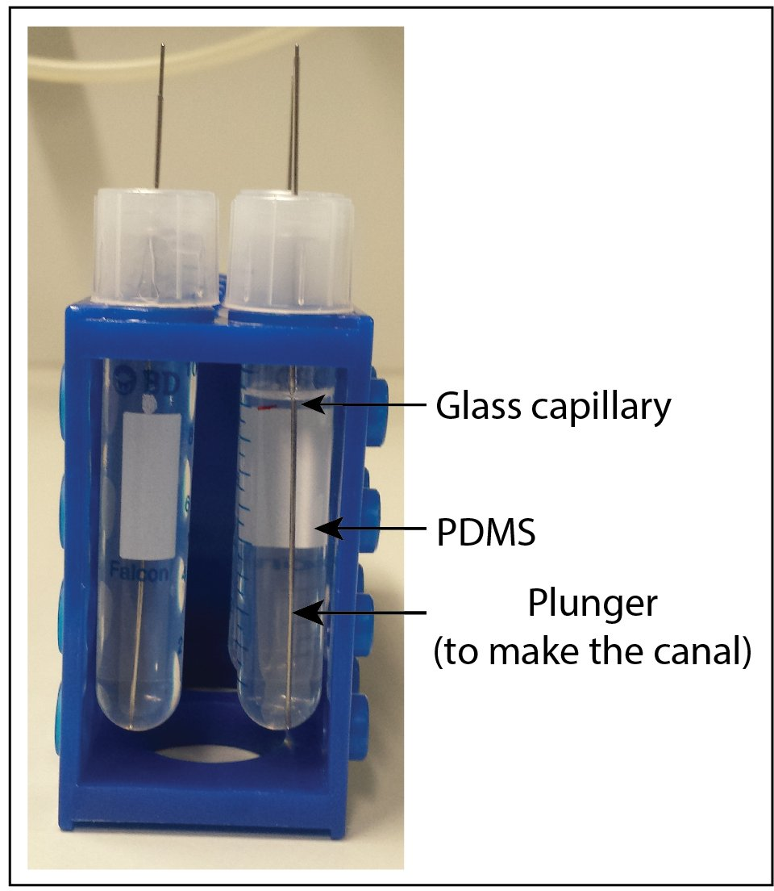

---
---
## Projects

 

### Studying MCF-10A morphogenesis in 3D cell culture

#### Imaging a fixed, large spheroid (ø ≈ 500 µm) on Zeiss Lightsheet Z.1

  - **Sample preparation**

We used a cell line expressing GFP-tagged histone 2B. The spheroid was
embedded together with beads in 1 % agarose in a glass capillary (black
label).

  - **Imaging**
      - 1 timepoint, 6 angles, dual-side illumination
      - excitation: 488 nm
      - detection: 20x ...

<!-- end list -->

  - **Results**

After approximately 2 h 6 min (2 h to set up the acquisition, 6 min to
run it) we had a nice 36 GB data set.

Fortunately we decided not to fuse the two illuminations online during
acquisition, but to keep them separate: We compared a simple fusion of
the two unregistered illuminations for one angle to the result after
performing a nuclei-based registration. Indeed the two views were
shifted in z (detection direction) by ≈ 10 µm—a nice example for large
samples causing aberrations.

Finally we registered all 12 views with nuclei and fused them. An
additional deconvolution using beads to determine the PSF produced an
even crisper image. However, we had to crop the image (and consequently
cut part of the spheroid) in order to limit the required memory to the
108 GB RAM available.

#### Overnight time-lapse imaging of living, 4-days-old spheroids (ø ≈ 50 µm) on Zeiss Lightsheet Z.1

  - **Sample preparation**

H2B-GFP cells were additionally labelled with the live-dye SiR-tubulin
([Lukinavičius et
al. 2014](http://www.nature.com/nmeth/journal/v11/n7/full/nmeth.2972.html)).
They were embedded as single cells in Matrigel and injected into
chambers made of either 1 % Gelrite or 1.5 % agarose. We incubated the
chambers and let the cells proliferate and form small spheroids for four
days.

In a second attempt we seeded single cells in Matrigel into FEP tubes,
but they died of oxygen deficiency very quickly.

  - **Imaging**

Unfortunately the Gelrite/agarose chambers were too thick compared to
the working distance of the imaging objective. Thus we could not take
any images of living spheroids.

-----

### Imaging of the two-photon laser-induced brain ablation in the zebrafish larvae

#### introduction and overview

I am interested in tissue regeneration in the zebrafish, especially
brain regeneration after traumatic injury. In my PhD, I focus on immune
cells that are main players in the inflammation because we characterized
acute inflammation as a positive regulator of the brain regeneration.
Considering dynamic property of those cells and days-long process of
inflammation, obtaining spatio-temporal information microscopy in which
specimen gets minimum photo-toxicity and photo-bleaching is an
attracting topic of research. Therefore, we decided to study dynamics of
immune cells by SPIM.  
In this course I would like to observe neuron dynamics in the zebrafish
brain after traumatic injury induced by two-photon laser. I visited Gene
Myers lab as they have excellent equipment on their SPIM, two-photon
light sheet laser which is used to make injury and single-photon light
sheet microscope which allows immediate observation. In addition, I used
an Open-SPIM only for observation after the ablation with Myers' SPIM
because it has more similar equipment to ours which we are going to
assemble in a month.

#### Laser-induced ablation and SPIM observation @ Myers' lab

 
'''Sample Preparation and Laser Ablation

  - 2 days post fertilization
  - PTU treated: to inhibit pigmentation
  - Expressing Ras-GFP: labeling cellular membrane
  - Special thanks to Jaroslav (Norden Lab), Michael and Michaela
    (Huiskin Lab)

1\. The zebrafish are anesthetized with tricane (200µg/mL) and embedded
into FEP tubes (inner and outer diameters: 0.8mm and 1.6mm,
respectively)filled with 0.1% agarose containing tricane.  
2\. A tube was fixed to a metal-based sample holder with adhesive tape
as shown in the picture on right.  
3\. To make the nearest access of the laser to the brain, the tube was
rotated dorsal-side upright (see the scheme).  
4\. By confining area of light sheet illumination with high-power
two-photon laser, we succeeded to make well-targeted injury as shown on
the right.  
'''Parameters for laser ablation  

  - Laser power: \<600mW
  - Wave length: 920 nm
  - Duration: \<2 sec

\>")  
  
  
  
  
  
  
  
  
  
  
  
  
'''Imaging and result

  - Objective lens: 40x 0.8 N.A. Water dipping, NIKON
  - Area: 331x331µm sq, 1µm x 100 Z stacks/time point, Single angle
  - Excitation: 488nm, \<2mW, exposure for 16 msec in average, single
    side illumination
  - Time-lapse: Every 30min for 12hr
  - Special thanks to Nicola (Myers Lab)

The movie shows the brain shrank soon after the ablation and tissue
components running out of the injured tissue were captured. After
shrinkage the brain bunched up due to either development or tissue
elasticity of the brain as it's often referred as sponge-like structure.
Observation of the other brain hemisphere with lower magnification will
define the cause of this morphological

#### SPIM observation with Open-SPIM

 
'''Sample Preparation

  - 3 days post fertilization
  - PTU treated: to inhibit pigmentation
  - Expressing HuC-GFP: labeling neuron
  - Sample has already been ablated with Myers' SPIM

'''Imaging and Result  
\*Objective lens: 20x 0.5 N.A. Water dipping, Olympus

  - Area: 26 x 22mm sq, µm x 134 Z stacks/time point, Single angle
  - Excitation: 488nm, \<, single side illumination
  - Time-lapse: Every 10min for 18.5hr
  - Special thanks to Pete (Tomancak Lab)

Unfortunately we could not find an injured spot with this sample. When
we were trying to make an injury, we could not define ROI well because,
somehow, this transgenic line emitted very blur fluorescence. It might
be because of the highly-compacted population of the neurons in the
brain. In this time-lapse movie, neurons are coloured according to the
depth of them within the sample. The movie shows dynamics of neurons
over developmental stages at single-cell level. During imaging the fish
moved and the focusing Z positions were shifted. This movement is most
likely due to the development not voluntary movement. This is inevitable
when working with zebrafish larvae, therefore, It would be solved by
better manipulation of data processing or development of a new function
of 4D-SPIM stage coupled with the camera, for instance, auto-chasing of
a certain remarkable structure in the specimen.  

#### Data Processing Procedure

Since we could not register the images from Open-SPIM in a way the
majority of the people does, probably because of high level of neuron
compaction in the brain, we took another way of processing. This might
be a unique case, thus, I would like to report here what steps we
followed.\*Special thanks to Olivieer  
'''Concatenation of the images

  - Open all the tif images that you would like to make into time-lapse.
  - Image\>Stacks\>Tools\>Concatenate\>All Open Windows
  - The resulting file contains the Z-stacks and the time points,
    however, it does not have two channels that are for Z-stack and time
    lapse.

'''Hyperstacking into a 4D image

  - Image\>Hyperstacks\>Stack to Hyperstack
  - Order:default, Channels: \# of colours, Slices: \# of Z stacks,
    Frames: \# of time points

'''Temporal Colour Code To show the depth of each Z stack, temporal
colour code will be useful

  - Image\>Hyperstacks\>Re-order Hyperstack
  - Change boxes to: size(z)-\>Frames(t), Frames(t)-\>slides(z)
  - Image\>Hyperstacks\>Temporal-Color code
  - LUT = Spectrum

'''Time Stamp To show each time points on 9time-lapse data, time stamp
is required.

  - Image\>Stacks\>Time Stamper

  
  

-----

### from Z stack to θ stack

#### Initial question and approach

Can we image the full periphery of an organism without generating a huge
amount of data that require extensive post processing time to be
reconstruct? One idea is to perform the imaging around the main axis of
the body, like camembert slices (figure 1). To keep the time resolution
high and the time to set up the experiment reasonable the acquisition of
the stacks would need to require only the rotation motor and not the
translation ones but that means that the main axis of the embryo must be
align with the one of the rotation motor.

To align the capillary and the motor axis 3D printers would give us a
precision lower than 10 µm and to center the embryo in the agarose tube
my idea is to us hydrodynamic forces. Indeed the mounting of the embryo
in the agarose happens at [low Reynolds
number](http://en.wikipedia.org/wiki/Stokes_flow#cite_note-Kirby-2/) ,
therefore a Poiseuille flow is established in the capillary during the
aspiration of the embryo, i.e. the speed of the fluid is maximal at the
center of the canal and null on the side. In theory due to the
[hydrodynamic drag](http://en.wikipedia.org/wiki/Drag_\(physics\)), for
an embryo with high aspect ratio like drosophila one of the equilibrium
position in this parabolic flow is at the center of the capillary with
its long axis parallel to the flow. The idea is to temper the capillary
containing the agarose and the sample while the flow is still running to
freeze the sample in position.

 Initial setup idea

#### making of the canal

##### first attempt

 making of the
canal

 after the
removal of the plunger

Because of the double surrounding wall around the pdms the extraction of
the glass capillary was impossible and it brokes. Once the entrance is
full of glasses pieces the canal become unusable

##### second attempt

 making of the
canal

 after the
removal of the plunger

The second version of the canal is promising but due to the lake of time
I only could try to mount two or three samples, unsuccessfully. Pouching
the sample in the cold capillary seems more efficient than sucking it
in.

##### High tech pressure generator

Not so good, a very slight movement of the seringe piston is equivalent
to the all volume of the capillary. I think it can be master but will
require quit a lot of practice

#### That being said

If you have at your disposal the computers, the softwares and the people
that knows how to use them why bother, just go full computer sience
approach

Video of the germ band retraction to come

## 1.4 Zebrafish larvae blood system imaging (Light sheet LZ. 1) and reconstruction (Multiveiw reconstruction)

Briefly describe the project here

#### 1.4.1 Sample Preparation

We used 2dpf zebrafish embryo: Casper Tg(kdrl:GFP) expressing
vascular-specific GFP labeled protein.The zebrafish was anesthetized
with tricane (200µg/mL) and embedded into capillary filled with 1.5%
agarose containing tricane and Beads: (Estapor® Fluorescent Microspheres
1:40000).

#### 1.4.2 Data acquisition and processing

To investigate vein structure we used Zeiss LZ.1 Light sheet microscope.
In order to image whole fish, image was acquired with 5 separate
(semi-manually selected) tiles function (Fig A), 20 x obj lens, two
sides illumination, one side detection and multiview function - 6 angles
(Fig B). Data Processing Procedure: 42GB data was analysed with use of
Reconstruction of Multiview Microscopy Data (ImageJ plugin developed by
Stephan Preibisch). For registation we used beads based system followed
by deconvolution and fusion (fiji plugin fiusion). For 3D animation we
use Fiji plugin 3D multiview. Because of problems with huge data
handling size of the image was reduced 2x.

Special thanks to Stephan Preibisch, Michaela Mickoleit, Jaroslav Icha,
Olivier Burri, Kirti Prakash and Daniele Soroldoni,

The circulatory system 3D reconstruction:

#### Description here

#### Description here

#### Description here

#### Description here

#### Description here

## summary

## Team members

<File:Edsinger.jpg>|[Eric Edsinger](User:EricEdsinger "wikilink")
<File:WioletaDudka.jpg>|[Wioleta
Dudka-Ruszkowska](User:Wioleta "wikilink") <File:Pujol.jpg>|[Thomas
Pujol](User:Pujol "wikilink") <File:Barthel.jpg>|[Hannah
Barthel](User:Hannah "wikilink") <File:Murata.jpg>|[Kei
Murata](User:Murata "wikilink")

## Local Guides

[File:Icha.jpg|Jaroslav](File:Icha.jpg%7CJaroslav) Icha
[File:Preibisch.jpg|Stephan](File:Preibisch.jpg%7CStephan) Preibisch

[Category:EMBO2014](Category:EMBO2014 "wikilink")
